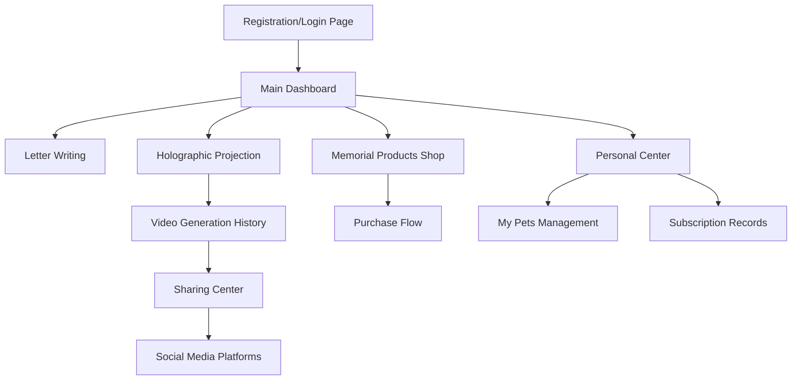

# Forever Paws Pet Memorial App - Product Requirements Document

## 1. Product Overview
Forever Paws is a compassionate pet memorial holographic video creation app that helps pet owners keep their beloved pets forever in their hearts through innovative 2.5D video technology and commemorative products.
- The app solves the emotional need for pet owners to memorialize their deceased pets through interactive holographic videos and personalized memorial products, providing comfort and lasting memories.
- Target market: Pet owners seeking meaningful ways to honor and remember their beloved pets, with potential for significant emotional and commercial value in the pet memorial industry.

## 2. Core Features

### 2.1 User Roles
| Role | Registration Method | Core Permissions |
|------|---------------------|------------------|
| Free User | Email/phone registration, Apple ID, Google account | Can write letters, generate 1 free holographic video, browse memorial products |
| Premium User | Subscription upgrade | Unlimited holographic video generation, access to premium memorial products, video downloads |

### 2.2 Feature Module
Our Forever Paws app consists of the following main pages:
1. **Registration/Login Page**: Apple ID login, Google login, email/phone registration and authentication
2. **Main Dashboard**: Personal center overview, feature navigation, recent activity display
3. **Letter Writing Page**: Compose and send virtual letters to deceased pets
4. **Holographic Projection Page**: Upload pet photos to generate 2.5D memorial videos
5. **Video Generation History**: View and manage all generated holographic videos
6. **Memorial Products Shop**: Browse and purchase customizable commemorative items
7. **Sharing Center**: Share generated videos to social media platforms
8. **Personal Center/My Profile**: Account management, pet information, subscription records
9. **My Pets Management**: Add pet information and store generated holographic videos

### 2.3 Page Details
| Page Name | Module Name | Feature description |
|-----------|-------------|---------------------|
| Registration/Login | Authentication | Support Apple ID and Google quick login, email/phone registration with password, forgot password recovery |
| Main Dashboard | Hero Section | Display warm pet placeholder image with "Replace with your pet's photo" text, feature grid navigation |
| Main Dashboard | Feature Navigation | Six main feature buttons: Write Letter, Memorial Shop, Daily Moments, Share Space, Holographic, My Profile |
| Main Dashboard | Recent Activity | Show recent letters from pets, video generation history, purchase activities |
| Letter Writing | Compose Interface | Text editor for writing letters to deceased pets, save drafts, send virtual letters |
| Letter Writing | Letter History | View all sent letters, organize by pet, search and filter options |
| Holographic Projection | Photo Upload | Upload single pet photo from gallery, image preview and editing tools |
| Holographic Projection | Video Generation | Generate 2.5D holographic video using AI technology, progress tracking, preview generated video |
| Video Generation History | Video Library | Display all generated videos in grid layout, filter by pet, date, download to phone gallery |
| Memorial Products | Product Catalog | Browse custom tombstones, fur collection necklaces, personalized memorial items |
| Memorial Products | Customization | Personalize products with pet names, photos, engravings, preview customizations |
| Memorial Products | Purchase Flow | Add to cart, checkout process, payment integration, order tracking |
| Sharing Center | Social Integration | Share videos to Instagram, Facebook, WhatsApp with custom captions |
| Personal Center | Profile Management | Edit profile picture from gallery, account settings, subscription management |
| Personal Center | My Pets Section | Add pet information (name, breed, photos), view associated holographic videos |
| Personal Center | Subscription Records | Display payment history for video generation fees and premium features |
| Personal Center | Support & Legal | Contact support (jason.kanyanjun@gmail.com), privacy policy, terms of service |

## 3. Core Process
**Main User Flow:**
Users register through Apple ID, Google account, or email/phone, then access the main dashboard featuring six core modules. They can write virtual letters to deceased pets, upload pet photos to generate holographic videos (with payment for additional videos), browse and purchase memorial products, share videos on social platforms, and manage their pet information and subscription records in the personal center.

**Premium User Flow:**
Premium users enjoy unlimited video generation, access to exclusive memorial products, and can download all videos to their phone gallery for permanent storage.

## 4. User Interface Design
### 4.1 Design Style
- Primary colors: Warm purple gradient (#E879F9 to #F472B6), soft beige background (#F5F5DC)
- Secondary colors: Orange (#FB923C), pink (#F472B6), yellow (#FBBF24), teal (#14B8A6), blue (#3B82F6)
- Button style: Rounded corners with gradient backgrounds, soft shadows for depth
- Font: SF Pro Display for iOS, clean and readable typography with 16-18px base size
- Layout style: Card-based design with rounded corners, warm color palette, grid-based feature navigation
- Icon style: SF Symbols with warm color fills, paw print and heart motifs throughout the interface

### 4.2 Page Design Overview
| Page Name | Module Name | UI Elements |
|-----------|-------------|-------------|
| Registration/Login | Authentication Form | Purple gradient background, white rounded cards, black "Continue with Apple" button, outlined "Continue with Google" button, purple gradient "Sign In" button |
| Main Dashboard | Hero Section | Large rounded card with warm pet photo, overlay button "Replace with your pet's photo", soft beige background |
| Main Dashboard | Feature Grid | 2x3 grid of colorful rounded square buttons with icons, warm color scheme (orange, pink, yellow, teal, blue) |
| Personal Center | Profile Header | User avatar with camera icon, username display, close button, warm beige overlay background |
| Personal Center | Menu Items | List items with icons, chevron arrows, clean typography, consistent spacing |
| Personal Center | Action Button | Red gradient logout button, full width, rounded corners |

### 4.3 Responsiveness
The app is designed mobile-first for iOS devices with touch interaction optimization. The interface adapts to different iPhone screen sizes while maintaining the warm, compassionate visual identity and ensuring easy navigation for users during emotional moments.