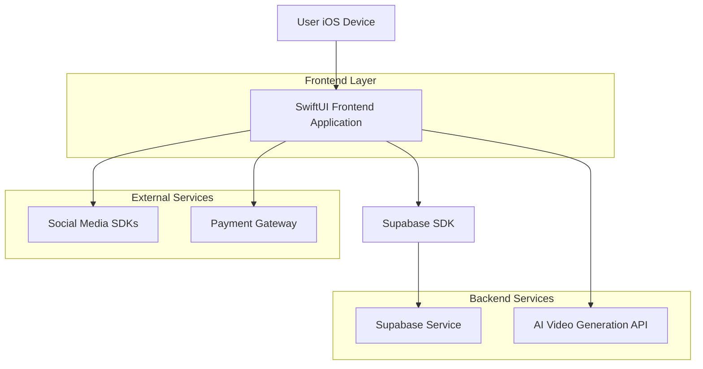
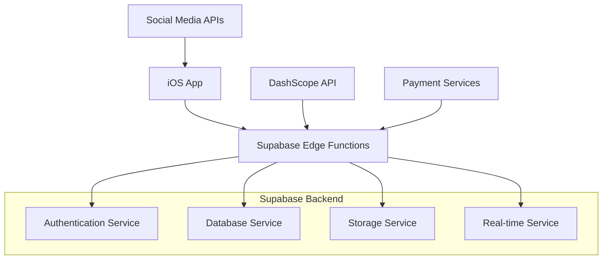
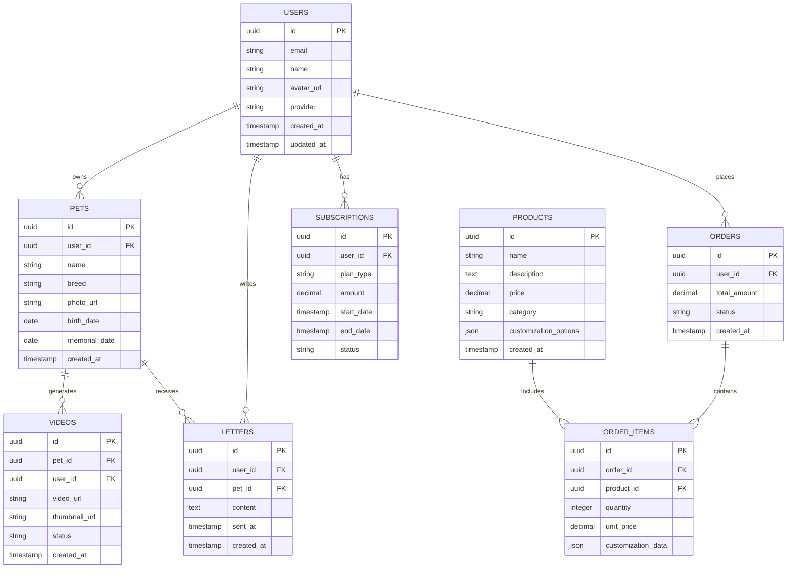

# Forever Paws Pet Memorial App - Technical Architecture Document

## 1. Architecture Design



## 2. Technology Description
- Frontend: SwiftUI + iOS 16+ + Combine
- Backend: Supabase (Authentication, Database, Storage)
- AI Services: DashScope API for holographic video generation
- Social Integration: Native iOS sharing capabilities
- Payment: Apple Pay + Stripe SDK
- Image Processing: Core Image + Vision Framework

## 3. Route Definitions
| Route | Purpose |
|-------|---------|
| /auth | Registration and login page with Apple ID, Google, email/phone options |
| /dashboard | Main dashboard with feature navigation and recent activity |
| /letter-writing | Compose and manage virtual letters to deceased pets |
| /holographic | Upload photos and generate 2.5D memorial videos |
| /video-history | View and manage all generated holographic videos |
| /memorial-shop | Browse and purchase commemorative products |
| /sharing | Share videos to social media platforms |
| /profile | Personal center with account management and pet information |
| /my-pets | Manage pet information and associated videos |
| /subscription | View payment history and manage subscriptions |

## 4. API Definitions

### 4.1 Core API

User authentication related
```
POST /auth/v1/token
```

Request:
| Param Name| Param Type  | isRequired  | Description |
|-----------|-------------|-------------|-------------|
| email     | string      | true        | User email address |
| password  | string      | true        | User password |

Response:
| Param Name| Param Type  | Description |
|-----------|-------------|-------------|
| access_token | string   | JWT access token |
| user      | object      | User profile information |

Pet management related
```
POST /rest/v1/pets
```

Request:
| Param Name| Param Type  | isRequired  | Description |
|-----------|-------------|-------------|-------------|
| name      | string      | true        | Pet name |
| breed     | string      | false       | Pet breed |
| photo_url | string      | false       | Pet photo URL |
| user_id   | uuid        | true        | Owner user ID |

Video generation related
```
POST /api/video/generate
```

Request:
| Param Name| Param Type  | isRequired  | Description |
|-----------|-------------|-------------|-------------|
| image_url | string      | true        | Pet photo URL |
| pet_id    | uuid        | true        | Associated pet ID |

Response:
| Param Name| Param Type  | Description |
|-----------|-------------|-------------|
| task_id   | string      | Video generation task ID |
| status    | string      | Generation status |

## 5. Server Architecture Diagram



## 6. Data Model

### 6.1 Data Model Definition



### 6.2 Data Definition Language

Users Table
```sql
-- Create users table (handled by Supabase Auth)
CREATE TABLE public.profiles (
    id UUID REFERENCES auth.users(id) PRIMARY KEY,
    email VARCHAR(255) UNIQUE NOT NULL,
    name VARCHAR(100),
    avatar_url TEXT,
    created_at TIMESTAMP WITH TIME ZONE DEFAULT NOW(),
    updated_at TIMESTAMP WITH TIME ZONE DEFAULT NOW()
);

-- Enable RLS
ALTER TABLE public.profiles ENABLE ROW LEVEL SECURITY;

-- Create policies
CREATE POLICY "Users can view own profile" ON public.profiles
    FOR SELECT USING (auth.uid() = id);

CREATE POLICY "Users can update own profile" ON public.profiles
    FOR UPDATE USING (auth.uid() = id);
```

Pets Table
```sql
-- Create pets table
CREATE TABLE public.pets (
    id UUID PRIMARY KEY DEFAULT gen_random_uuid(),
    user_id UUID REFERENCES public.profiles(id) ON DELETE CASCADE,
    name VARCHAR(100) NOT NULL,
    breed VARCHAR(100),
    photo_url TEXT,
    birth_date DATE,
    memorial_date DATE,
    created_at TIMESTAMP WITH TIME ZONE DEFAULT NOW()
);

-- Enable RLS
ALTER TABLE public.pets ENABLE ROW LEVEL SECURITY;

-- Create policies
CREATE POLICY "Users can manage own pets" ON public.pets
    FOR ALL USING (auth.uid() = user_id);

-- Create indexes
CREATE INDEX idx_pets_user_id ON public.pets(user_id);
```

Videos Table
```sql
-- Create videos table
CREATE TABLE public.videos (
    id UUID PRIMARY KEY DEFAULT gen_random_uuid(),
    pet_id UUID REFERENCES public.pets(id) ON DELETE CASCADE,
    user_id UUID REFERENCES public.profiles(id) ON DELETE CASCADE,
    video_url TEXT,
    thumbnail_url TEXT,
    status VARCHAR(20) DEFAULT 'processing' CHECK (status IN ('processing', 'completed', 'failed')),
    created_at TIMESTAMP WITH TIME ZONE DEFAULT NOW()
);

-- Enable RLS
ALTER TABLE public.videos ENABLE ROW LEVEL SECURITY;

-- Create policies
CREATE POLICY "Users can manage own videos" ON public.videos
    FOR ALL USING (auth.uid() = user_id);

-- Create indexes
CREATE INDEX idx_videos_user_id ON public.videos(user_id);
CREATE INDEX idx_videos_pet_id ON public.videos(pet_id);
CREATE INDEX idx_videos_created_at ON public.videos(created_at DESC);
```

Letters Table
```sql
-- Create letters table
CREATE TABLE public.letters (
    id UUID PRIMARY KEY DEFAULT gen_random_uuid(),
    user_id UUID REFERENCES public.profiles(id) ON DELETE CASCADE,
    pet_id UUID REFERENCES public.pets(id) ON DELETE CASCADE,
    content TEXT NOT NULL,
    sent_at TIMESTAMP WITH TIME ZONE DEFAULT NOW(),
    created_at TIMESTAMP WITH TIME ZONE DEFAULT NOW()
);

-- Enable RLS
ALTER TABLE public.letters ENABLE ROW LEVEL SECURITY;

-- Create policies
CREATE POLICY "Users can manage own letters" ON public.letters
    FOR ALL USING (auth.uid() = user_id);

-- Create indexes
CREATE INDEX idx_letters_user_id ON public.letters(user_id);
CREATE INDEX idx_letters_pet_id ON public.letters(pet_id);
CREATE INDEX idx_letters_sent_at ON public.letters(sent_at DESC);
```

Subscriptions Table
```sql
-- Create subscriptions table
CREATE TABLE public.subscriptions (
    id UUID PRIMARY KEY DEFAULT gen_random_uuid(),
    user_id UUID REFERENCES public.profiles(id) ON DELETE CASCADE,
    plan_type VARCHAR(20) DEFAULT 'free' CHECK (plan_type IN ('free', 'premium')),
    amount DECIMAL(10,2),
    start_date TIMESTAMP WITH TIME ZONE DEFAULT NOW(),
    end_date TIMESTAMP WITH TIME ZONE,
    status VARCHAR(20) DEFAULT 'active' CHECK (status IN ('active', 'cancelled', 'expired')),
    created_at TIMESTAMP WITH TIME ZONE DEFAULT NOW()
);

-- Enable RLS
ALTER TABLE public.subscriptions ENABLE ROW LEVEL SECURITY;

-- Create policies
CREATE POLICY "Users can view own subscriptions" ON public.subscriptions
    FOR SELECT USING (auth.uid() = user_id);

-- Create indexes
CREATE INDEX idx_subscriptions_user_id ON public.subscriptions(user_id);
```

Products and Orders Tables
```sql
-- Create products table
CREATE TABLE public.products (
    id UUID PRIMARY KEY DEFAULT gen_random_uuid(),
    name VARCHAR(200) NOT NULL,
    description TEXT,
    price DECIMAL(10,2) NOT NULL,
    category VARCHAR(50) NOT NULL,
    customization_options JSONB,
    created_at TIMESTAMP WITH TIME ZONE DEFAULT NOW()
);

-- Create orders table
CREATE TABLE public.orders (
    id UUID PRIMARY KEY DEFAULT gen_random_uuid(),
    user_id UUID REFERENCES public.profiles(id) ON DELETE CASCADE,
    total_amount DECIMAL(10,2) NOT NULL,
    status VARCHAR(20) DEFAULT 'pending' CHECK (status IN ('pending', 'processing', 'shipped', 'delivered', 'cancelled')),
    created_at TIMESTAMP WITH TIME ZONE DEFAULT NOW()
);

-- Create order_items table
CREATE TABLE public.order_items (
    id UUID PRIMARY KEY DEFAULT gen_random_uuid(),
    order_id UUID REFERENCES public.orders(id) ON DELETE CASCADE,
    product_id UUID REFERENCES public.products(id),
    quantity INTEGER NOT NULL DEFAULT 1,
    unit_price DECIMAL(10,2) NOT NULL,
    customization_data JSONB
);

-- Enable RLS for orders
ALTER TABLE public.orders ENABLE ROW LEVEL SECURITY;
ALTER TABLE public.order_items ENABLE ROW LEVEL SECURITY;

-- Create policies for orders
CREATE POLICY "Users can manage own orders" ON public.orders
    FOR ALL USING (auth.uid() = user_id);

CREATE POLICY "Users can view own order items" ON public.order_items
    FOR SELECT USING (
        EXISTS (
            SELECT 1 FROM public.orders 
            WHERE orders.id = order_items.order_id 
            AND orders.user_id = auth.uid()
        )
    );

-- Grant permissions
GRANT SELECT ON public.products TO anon;
GRANT ALL PRIVILEGES ON public.profiles TO authenticated;
GRANT ALL PRIVILEGES ON public.pets TO authenticated;
GRANT ALL PRIVILEGES ON public.videos TO authenticated;
GRANT ALL PRIVILEGES ON public.letters TO authenticated;
GRANT ALL PRIVILEGES ON public.subscriptions TO authenticated;
GRANT ALL PRIVILEGES ON public.orders TO authenticated;
GRANT ALL PRIVILEGES ON public.order_items TO authenticated;
```