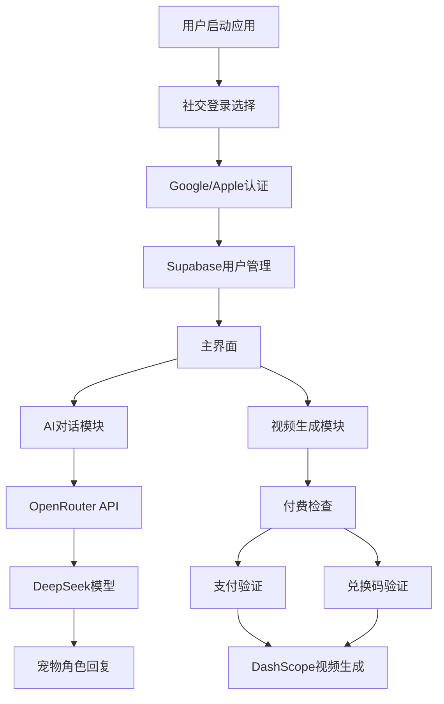

# Forever Paws 功能升级需求文档 - OpenRouter集成与付费系统

## 1. 项目概述

Forever Paws宠物纪念应用功能升级，集成AI对话、真实社交登录、付费视频生成和兑换码系统，为用户提供更加真实和个性化的宠物纪念体验。

- 通过OpenRouter API实现宠物角色扮演对话，让用户与已故宠物进行情感交流
- 集成Google和Apple真实社交登录，确保用户数据安全和便捷访问
- 建立付费视频生成机制，提供高质量的纪念视频服务
- 实现兑换码系统，为用户提供免费体验机会

## 2. 核心功能升级

### 2.1 用户角色与权限
| 角色 | 注册方式 | 核心权限 |
|------|----------|----------|
| 免费用户 | Google/Apple社交登录 | 基础功能、AI对话、查看历史 |
| 付费用户 | 社交登录 + 付费验证 | 所有功能、视频生成、无限对话 |
| 兑换码用户 | 社交登录 + 兑换码 | 免费生成1次视频 |

### 2.2 功能模块升级

升级后的Forever Paws应用包含以下主要功能：

1. **用户认证系统**：Google/Apple社交登录，Supabase用户管理
2. **AI宠物对话模块**：OpenRouter API集成，DeepSeek R1T2 Chimera模型
3. **付费视频生成**：2.8美金收费机制，支付验证系统
4. **兑换码系统**：一次性免费视频生成码
5. **用户中心**：账户管理、支付历史、兑换码管理
6. **数据同步**：跨设备用户数据同步

### 2.3 页面功能详情

| 页面名称 | 模块名称 | 功能描述 |
|----------|----------|----------|
| 登录页面 | 社交登录 | Google/Apple登录按钮，Supabase认证集成，自动用户创建 |
| 写信对话页面 | AI对话引擎 | OpenRouter API调用，DeepSeek模型，宠物角色扮演，对话历史保存 |
| 视频生成页面 | 付费验证 | 2.8美金收费提示，支付验证，兑换码输入，生成限制检查 |
| 兑换码页面 | 兑换系统 | 兑换码输入验证，一次性使用检查，免费额度激活 |
| 个人中心 | 账户管理 | 用户信息显示，支付历史，兑换码状态，登出功能 |
| 支付页面 | 支付处理 | 价格显示，支付方式选择，交易确认，支付状态反馈 |

## 3. 核心流程

### 3.1 用户认证流程
用户打开应用 → 选择Google/Apple登录 → 社交平台认证 → Supabase用户创建/登录 → 进入主界面

### 3.2 AI对话流程
选择宠物 → 进入对话界面 → 输入消息 → OpenRouter API调用 → DeepSeek模型响应 → 显示宠物回复 → 保存对话历史

### 3.3 付费视频生成流程
选择图片 → 检查用户权限 → 显示付费提示(2.8美金) → 用户选择支付/兑换码 → 验证支付/兑换码 → 调用DashScope API → 生成视频

### 3.4 兑换码使用流程
获取兑换码 → 进入兑换页面 → 输入兑换码 → 验证码有效性 → 激活免费额度 → 标记兑换码已使用

## 4. 用户界面设计

### 4.1 设计风格
- 主色调：温暖紫色渐变 (#8B5CF6 到 #A78BFA)
- 辅助色：柔和米色背景 (#FEF7ED)
- 按钮样式：圆角卡片设计，3D阴影效果
- 字体：SF Pro Display，主标题18pt，正文16pt
- 布局：卡片式设计，顶部导航栏
- 图标：SF Symbols系统图标，情感化宠物图标

### 4.2 页面设计概览

| 页面名称 | 模块名称 | UI元素 |
|----------|----------|---------|
| 登录页面 | 社交登录按钮 | Google/Apple登录按钮，品牌Logo，温暖背景渐变 |
| AI对话页面 | 对话界面 | 聊天气泡设计，宠物头像，输入框，发送按钮，历史记录 |
| 付费页面 | 支付界面 | 价格显示卡片，支付按钮，兑换码输入框，安全提示 |
| 兑换码页面 | 兑换界面 | 兑换码输入框，验证按钮，状态提示，使用说明 |
| 个人中心 | 用户信息 | 头像显示，账户信息卡片，支付历史列表，设置选项 |

### 4.3 响应式设计
- 移动端优先设计，适配iPhone和iPad
- 支持横屏和竖屏模式
- 触摸交互优化，手势支持
- 动画过渡效果，提升用户体验

## 5. 技术实现要点

### 5.1 OpenRouter API集成
- API端点：https://openrouter.ai/api/v1/chat/completions
- 模型：deepseek/deepseek-r1-distill-llama-70b
- 认证：Bearer Token方式
- 请求格式：标准OpenAI兼容格式
- 角色设定：系统提示词定义宠物性格

### 5.2 社交登录集成
- Google Sign-In SDK集成
- Apple Sign In集成
- Supabase Auth配置
- 用户数据自动同步
- 跨平台登录状态管理

### 5.3 付费系统设计
- 固定价格：2.8美金/次
- 支付网关：Apple Pay/Google Pay
- 交易记录：Supabase数据库存储
- 支付验证：服务端验证机制
- 退款处理：标准退款流程

### 5.4 兑换码系统
- 兑换码格式：8位字母数字组合
- 生成算法：UUID + 校验位
- 存储方式：Supabase数据库
- 验证机制：一次性使用检查
- 过期机制：可设置有效期