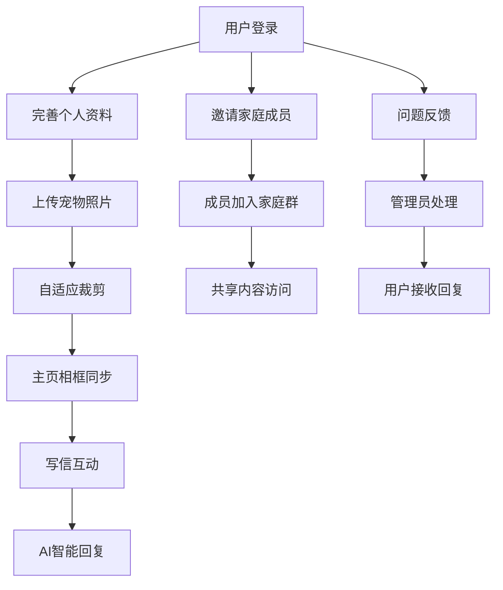

# Forever Paws 功能增强需求文档 - 照片管理与家庭共享系统

## 1. 产品概述
Forever Paws 应用功能增强，重点提升用户体验和智能交互能力。本次升级包括自适应照片裁剪、个人资料管理、家庭共享功能、客服支持系统和隐私政策完善等核心功能。
- 通过智能照片管理和个人资料系统，为AI对话提供更丰富的背景信息，提升宠物角色扮演的真实性和个性化程度。
- 建立完整的家庭共享生态系统，让多个家庭成员能够共同缅怀和纪念宠物，增强情感连接和用户粘性。

## 2. 核心功能

### 2.1 用户角色
| 角色 | 注册方式 | 核心权限 |
|------|----------|----------|
| 主账户用户 | 邮箱注册或第三方登录 | 创建宠物档案、邀请家庭成员、管理所有内容 |
| 家庭成员 | 通过邀请码加入 | 查看共享内容、参与互动、无法删除主要内容 |
| 管理员 | 后台系统 | 处理用户反馈、内容审核、系统管理 |

### 2.2 功能模块
本次功能增强包括以下主要页面和模块：
1. **照片管理系统**：自适应裁剪、主页同步显示、个人头像管理
2. **个人中心增强**：用户资料编辑、偏好设置、照片管理
3. **智能对话优化**：背景信息集成、个性化回复生成
4. **帮助与支持**：问题反馈表单、管理员回复系统
5. **隐私政策页面**：美国法规合规内容展示
6. **设置页面增强**：家庭成员管理、账户设置、共享权限控制

### 2.3 页面详情
| 页面名称 | 模块名称 | 功能描述 |
|----------|----------|----------|
| 主页 | 宠物照片相框 | 显示用户上传的宠物照片，支持自适应裁剪和实时同步更新 |
| 照片上传 | 自适应裁剪工具 | 提供智能裁剪建议，支持手动调整，确保照片质量和比例 |
| 个人中心 | 用户资料管理 | 上传个人头像、编辑姓名、填写兴趣爱好、个人偏好设置 |
| 个人中心 | 宠物档案管理 | 编辑宠物详细信息、性格特征、生活习惯、特殊记忆 |
| 写信模块 | 智能背景集成 | 自动整合宠物和主人信息作为AI对话背景，提升回复质量 |
| 帮助支持 | 问题反馈系统 | 快捷问题分类选择、详细描述填写、附件上传功能 |
| 帮助支持 | 回复通知中心 | 显示管理员回复、消息状态跟踪、历史对话记录 |
| 隐私政策 | 法规内容展示 | 符合美国COPPA、CCPA等法规的隐私政策条款 |
| 设置页面 | 家庭成员管理 | 邀请家庭成员、权限设置、共享内容管理 |
| 设置页面 | 账户安全管理 | 密码修改、登录设备管理、数据导出功能 |

## 3. 核心流程

### 主用户操作流程
用户首先在个人中心完善个人资料和宠物档案信息，然后上传宠物照片并进行自适应裁剪，系统自动同步到主页相框显示。在写信时，系统自动将用户和宠物的背景信息传递给AI模型，生成更个性化的回复。用户可以通过设置页面邀请家庭成员，共享宠物相关的所有内容。

### 家庭成员协作流程
被邀请的家庭成员通过邀请码注册并加入家庭群组，可以查看共享的宠物视频、信件回复和照片，参与写信互动，但无法修改核心设置或删除重要内容。

### 客服支持流程
用户在帮助支持页面选择问题类型，填写详细描述并提交，管理员在后台系统接收并处理，回复后用户收到应用内通知。

## 4. 用户界面设计

### 4.1 设计风格
- 主色调：温暖的米色 (#F5F5DC) 和柔和的蓝色 (#87CEEB)
- 辅助色：淡粉色 (#FFB6C1) 用于强调，深灰色 (#696969) 用于文本
- 按钮样式：圆角矩形设计，带有轻微阴影效果
- 字体：系统默认字体，标题使用 18-20pt，正文使用 14-16pt
- 布局风格：卡片式设计，顶部导航栏，底部标签栏
- 图标风格：线性图标配合填充图标，温馨可爱的宠物主题图标

### 4.2 页面设计概览
| 页面名称 | 模块名称 | UI元素 |
|----------|----------|---------|
| 主页 | 宠物相框 | 圆形或方形相框，支持多张照片轮播，添加温馨边框效果 |
| 照片上传 | 裁剪工具 | 拖拽式裁剪框，预设比例选择，实时预览效果 |
| 个人中心 | 资料编辑 | 头像上传区域，表单输入框，标签式兴趣选择 |
| 帮助支持 | 反馈表单 | 问题分类下拉菜单，多行文本输入，附件上传按钮 |
| 设置页面 | 家庭管理 | 成员列表卡片，邀请按钮，权限开关控件 |

### 4.3 响应式设计
应用采用移动端优先设计，支持iPhone和iPad的自适应布局。在iPad上提供更宽松的布局和更大的交互区域，充分利用屏幕空间展示更多内容。支持横屏和竖屏切换，确保在不同设备和方向下都有良好的用户体验。