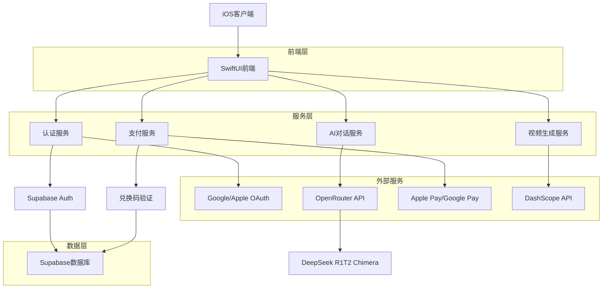
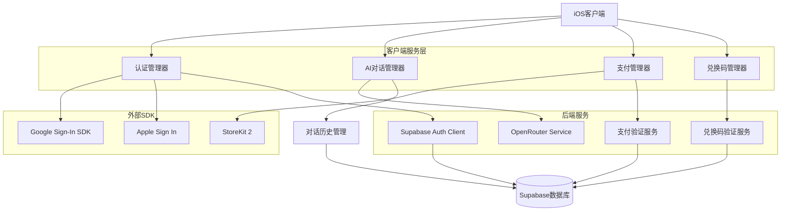
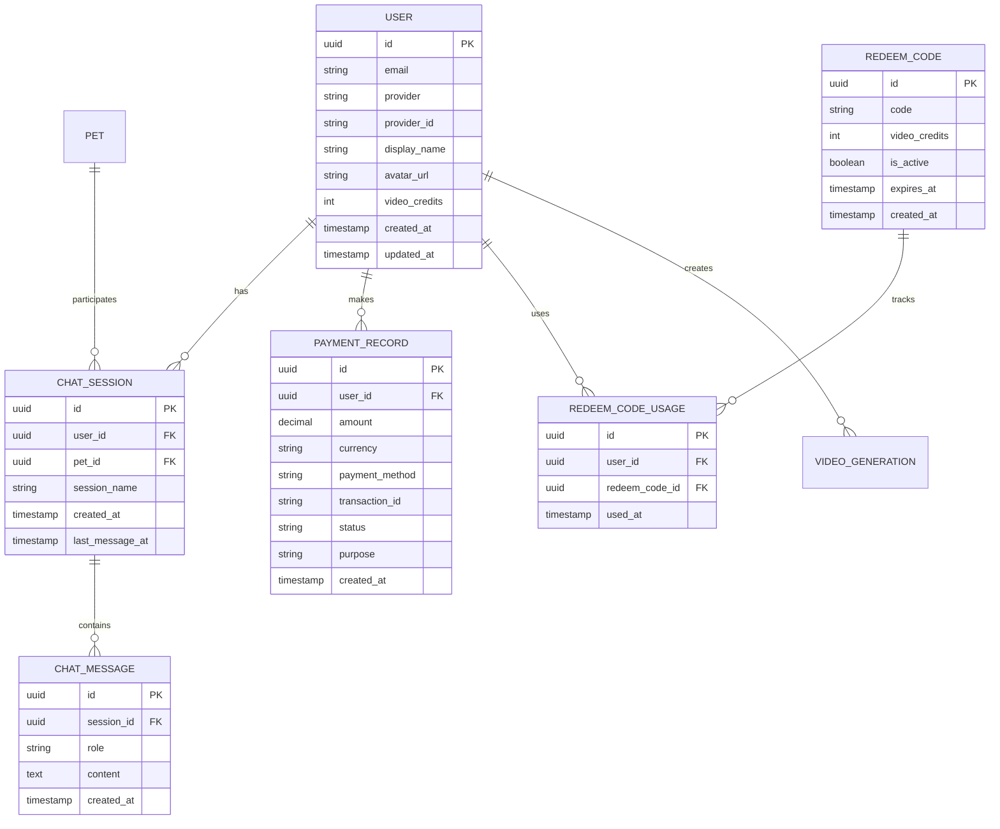

# Forever Paws 技术架构升级文档 - OpenRouter与付费系统

## 1. 架构设计



## 2. 技术栈描述

- **前端**: SwiftUI + iOS 17+ + Combine
- **认证**: Supabase Auth + Google Sign-In + Apple Sign In
- **AI服务**: OpenRouter API + DeepSeek R1T2 Chimera
- **支付**: StoreKit 2 + Apple Pay + Google Pay
- **数据库**: Supabase (PostgreSQL)
- **视频生成**: DashScope API (保持不变)
- **本地存储**: SwiftData + UserDefaults

## 3. 路由定义

| 路由 | 用途 |
|------|------|
| /login | 社交登录页面，Google/Apple登录选择 |
| /dashboard | 主界面，显示所有功能模块入口 |
| /chat/:petId | AI对话页面，与指定宠物进行角色扮演对话 |
| /video-generation | 视频生成页面，包含付费验证和兑换码功能 |
| /payment | 支付页面，处理2.8美金视频生成费用 |
| /redeem-code | 兑换码页面，输入和验证兑换码 |
| /profile | 个人中心，用户信息和支付历史 |
| /settings | 设置页面，账户管理和偏好设置 |

## 4. API定义

### 4.1 OpenRouter AI对话API

**宠物角色扮演对话**
```
POST https://openrouter.ai/api/v1/chat/completions
```

请求头:
| 参数名 | 参数类型 | 是否必需 | 描述 |
|--------|----------|----------|------|
| Authorization | string | true | Bearer {API_KEY} |
| Content-Type | string | true | application/json |
| HTTP-Referer | string | true | 应用标识符 |

请求体:
| 参数名 | 参数类型 | 是否必需 | 描述 |
|--------|----------|----------|------|
| model | string | true | deepseek/deepseek-r1-distill-llama-70b |
| messages | array | true | 对话消息数组 |
| temperature | number | false | 0.7 (创造性控制) |
| max_tokens | number | false | 1000 |

响应:
| 参数名 | 参数类型 | 描述 |
|--------|----------|------|
| choices | array | AI回复选择数组 |
| usage | object | Token使用统计 |

示例请求:
```json
{
  "model": "deepseek/deepseek-r1-distill-llama-70b",
  "messages": [
    {
      "role": "system",
      "content": "你是一只名叫小白的金毛犬，性格温和友善，喜欢和主人玩耍。请以宠物的身份回复主人的消息。"
    },
    {
      "role": "user", 
      "content": "小白，我很想你"
    }
  ],
  "temperature": 0.7,
  "max_tokens": 1000
}
```

### 4.2 支付验证API

**视频生成支付验证**
```
POST /api/payment/verify-video-generation
```

请求:
| 参数名 | 参数类型 | 是否必需 | 描述 |
|--------|----------|----------|------|
| user_id | string | true | 用户ID |
| payment_method | string | true | apple_pay/google_pay |
| transaction_id | string | true | 交易ID |
| amount | number | true | 支付金额(2.8) |

响应:
| 参数名 | 参数类型 | 描述 |
|--------|----------|------|
| success | boolean | 支付验证结果 |
| video_credit | number | 视频生成额度 |
| transaction_record | object | 交易记录 |

### 4.3 兑换码验证API

**兑换码验证和使用**
```
POST /api/redeem-code/validate
```

请求:
| 参数名 | 参数类型 | 是否必需 | 描述 |
|--------|----------|----------|------|
| user_id | string | true | 用户ID |
| redeem_code | string | true | 8位兑换码 |

响应:
| 参数名 | 参数类型 | 描述 |
|--------|----------|------|
| valid | boolean | 兑换码有效性 |
| used | boolean | 是否已使用 |
| video_credit | number | 获得的视频额度 |

## 5. 服务架构图



## 6. 数据模型

### 6.1 数据模型定义



### 6.2 数据定义语言

**用户表 (users)**
```sql
-- 扩展现有用户表
ALTER TABLE users ADD COLUMN IF NOT EXISTS provider VARCHAR(50);
ALTER TABLE users ADD COLUMN IF NOT EXISTS provider_id VARCHAR(255);
ALTER TABLE users ADD COLUMN IF NOT EXISTS display_name VARCHAR(100);
ALTER TABLE users ADD COLUMN IF NOT EXISTS avatar_url TEXT;
ALTER TABLE users ADD COLUMN IF NOT EXISTS video_credits INTEGER DEFAULT 0;

-- 创建索引
CREATE INDEX IF NOT EXISTS idx_users_provider ON users(provider, provider_id);
```

**AI对话会话表 (chat_sessions)**
```sql
CREATE TABLE IF NOT EXISTS chat_sessions (
    id UUID PRIMARY KEY DEFAULT gen_random_uuid(),
    user_id UUID REFERENCES users(id) ON DELETE CASCADE,
    pet_id UUID REFERENCES pets(id) ON DELETE CASCADE,
    session_name VARCHAR(255) NOT NULL,
    created_at TIMESTAMP WITH TIME ZONE DEFAULT NOW(),
    last_message_at TIMESTAMP WITH TIME ZONE DEFAULT NOW()
);

CREATE INDEX idx_chat_sessions_user_id ON chat_sessions(user_id);
CREATE INDEX idx_chat_sessions_pet_id ON chat_sessions(pet_id);
```

**AI对话消息表 (chat_messages)**
```sql
CREATE TABLE IF NOT EXISTS chat_messages (
    id UUID PRIMARY KEY DEFAULT gen_random_uuid(),
    session_id UUID REFERENCES chat_sessions(id) ON DELETE CASCADE,
    role VARCHAR(20) NOT NULL CHECK (role IN ('user', 'assistant', 'system')),
    content TEXT NOT NULL,
    created_at TIMESTAMP WITH TIME ZONE DEFAULT NOW()
);

CREATE INDEX idx_chat_messages_session_id ON chat_messages(session_id);
CREATE INDEX idx_chat_messages_created_at ON chat_messages(created_at DESC);
```

**支付记录表 (payment_records)**
```sql
CREATE TABLE IF NOT EXISTS payment_records (
    id UUID PRIMARY KEY DEFAULT gen_random_uuid(),
    user_id UUID REFERENCES users(id) ON DELETE CASCADE,
    amount DECIMAL(10,2) NOT NULL,
    currency VARCHAR(3) DEFAULT 'USD',
    payment_method VARCHAR(50) NOT NULL,
    transaction_id VARCHAR(255) UNIQUE NOT NULL,
    status VARCHAR(20) DEFAULT 'pending' CHECK (status IN ('pending', 'completed', 'failed', 'refunded')),
    purpose VARCHAR(100) DEFAULT 'video_generation',
    created_at TIMESTAMP WITH TIME ZONE DEFAULT NOW()
);

CREATE INDEX idx_payment_records_user_id ON payment_records(user_id);
CREATE INDEX idx_payment_records_transaction_id ON payment_records(transaction_id);
```

**兑换码表 (redeem_codes)**
```sql
CREATE TABLE IF NOT EXISTS redeem_codes (
    id UUID PRIMARY KEY DEFAULT gen_random_uuid(),
    code VARCHAR(8) UNIQUE NOT NULL,
    video_credits INTEGER DEFAULT 1,
    is_active BOOLEAN DEFAULT true,
    expires_at TIMESTAMP WITH TIME ZONE,
    created_at TIMESTAMP WITH TIME ZONE DEFAULT NOW()
);

CREATE INDEX idx_redeem_codes_code ON redeem_codes(code);
CREATE INDEX idx_redeem_codes_active ON redeem_codes(is_active, expires_at);
```

**兑换码使用记录表 (redeem_code_usage)**
```sql
CREATE TABLE IF NOT EXISTS redeem_code_usage (
    id UUID PRIMARY KEY DEFAULT gen_random_uuid(),
    user_id UUID REFERENCES users(id) ON DELETE CASCADE,
    redeem_code_id UUID REFERENCES redeem_codes(id) ON DELETE CASCADE,
    used_at TIMESTAMP WITH TIME ZONE DEFAULT NOW(),
    UNIQUE(user_id, redeem_code_id)
);

CREATE INDEX idx_redeem_code_usage_user_id ON redeem_code_usage(user_id);
CREATE INDEX idx_redeem_code_usage_code_id ON redeem_code_usage(redeem_code_id);
```

**初始化兑换码数据**
```sql
-- 插入示例兑换码
INSERT INTO redeem_codes (code, video_credits, expires_at) VALUES
('WELCOME1', 1, NOW() + INTERVAL '30 days'),
('FREEVID1', 1, NOW() + INTERVAL '60 days'),
('TESTCODE', 1, NOW() + INTERVAL '7 days');
```

## 7. 安全考虑

### 7.1 认证安全
- OAuth 2.0标准认证流程
- JWT Token安全存储
- 自动Token刷新机制
- 设备绑定验证

### 7.2 支付安全
- 服务端支付验证
- 交易记录加密存储
- 防重复支付机制
- 退款处理流程

### 7.3 API安全
- API密钥安全存储
- 请求频率限制
- 数据传输加密
- 用户权限验证

### 7.4 兑换码安全
- 一次性使用验证
- 过期时间检查
- 防暴力破解机制
- 使用记录审计