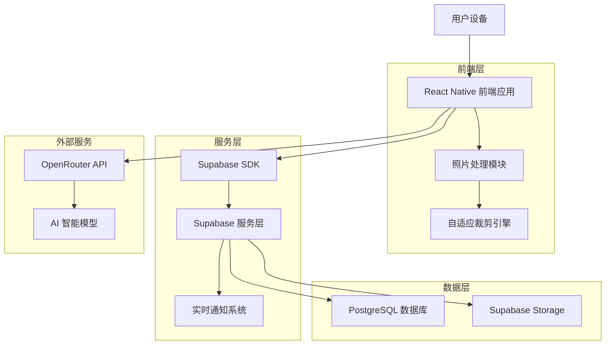
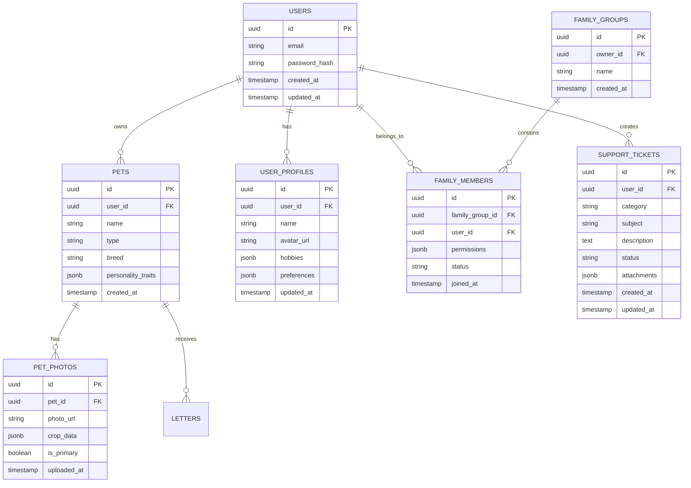

# Forever Paws 技术架构增强文档 - 照片管理与家庭共享系统

## 1. 架构设计



## 2. 技术描述
- 前端：React Native@0.72 + TypeScript + React Navigation@6
- 照片处理：react-native-image-crop-picker + react-native-image-resizer
- 状态管理：Redux Toolkit + RTK Query
- 数据库：Supabase (PostgreSQL)
- 文件存储：Supabase Storage
- 实时功能：Supabase Realtime
- AI服务：OpenRouter API

## 3. 路由定义
| 路由 | 用途 |
|------|-----|
| /home | 主页，显示宠物相框和主要导航 |
| /profile | 个人中心，用户资料和宠物档案管理 |
| /photo-upload | 照片上传和裁剪页面 |
| /family-settings | 家庭成员管理页面 |
| /help-support | 帮助与支持，问题反馈系统 |
| /privacy-policy | 隐私政策展示页面 |
| /settings | 应用设置和账户管理 |

## 4. API 定义

### 4.1 用户资料管理 API

用户资料更新
```
PUT /api/user/profile
```

请求参数：
| 参数名称 | 参数类型 | 是否必需 | 描述 |
|----------|----------|----------|------|
| name | string | false | 用户姓名 |
| avatar_url | string | false | 头像URL |
| hobbies | string[] | false | 兴趣爱好列表 |
| preferences | object | false | 个人偏好设置 |

响应：
| 参数名称 | 参数类型 | 描述 |
|----------|----------|------|
| success | boolean | 更新状态 |
| user | object | 更新后的用户信息 |

### 4.2 照片管理 API

照片上传
```
POST /api/photos/upload
```

请求参数：
| 参数名称 | 参数类型 | 是否必需 | 描述 |
|----------|----------|----------|------|
| file | File | true | 照片文件 |
| pet_id | string | false | 关联的宠物ID |
| crop_data | object | false | 裁剪参数 |

### 4.3 家庭成员管理 API

邀请家庭成员
```
POST /api/family/invite
```

请求参数：
| 参数名称 | 参数类型 | 是否必需 | 描述 |
|----------|----------|----------|------|
| email | string | true | 被邀请人邮箱 |
| permissions | string[] | true | 权限列表 |

### 4.4 支持系统 API

提交问题反馈
```
POST /api/support/feedback
```

请求参数：
| 参数名称 | 参数类型 | 是否必需 | 描述 |
|----------|----------|----------|------|
| category | string | true | 问题分类 |
| description | string | true | 问题描述 |
| attachments | File[] | false | 附件文件 |

## 5. 数据模型

### 5.1 数据模型定义



### 5.2 数据定义语言

用户资料表 (user_profiles)
```sql
-- 创建用户资料表
CREATE TABLE user_profiles (
    id UUID PRIMARY KEY DEFAULT gen_random_uuid(),
    user_id UUID REFERENCES auth.users(id) ON DELETE CASCADE,
    name VARCHAR(100),
    avatar_url TEXT,
    hobbies JSONB DEFAULT '[]'::jsonb,
    preferences JSONB DEFAULT '{}'::jsonb,
    created_at TIMESTAMP WITH TIME ZONE DEFAULT NOW(),
    updated_at TIMESTAMP WITH TIME ZONE DEFAULT NOW()
);

-- 宠物照片表
CREATE TABLE pet_photos (
    id UUID PRIMARY KEY DEFAULT gen_random_uuid(),
    pet_id UUID REFERENCES pets(id) ON DELETE CASCADE,
    photo_url TEXT NOT NULL,
    crop_data JSONB,
    is_primary BOOLEAN DEFAULT false,
    uploaded_at TIMESTAMP WITH TIME ZONE DEFAULT NOW()
);

-- 家庭群组表
CREATE TABLE family_groups (
    id UUID PRIMARY KEY DEFAULT gen_random_uuid(),
    owner_id UUID REFERENCES auth.users(id) ON DELETE CASCADE,
    name VARCHAR(100) NOT NULL,
    created_at TIMESTAMP WITH TIME ZONE DEFAULT NOW()
);

-- 家庭成员表
CREATE TABLE family_members (
    id UUID PRIMARY KEY DEFAULT gen_random_uuid(),
    family_group_id UUID REFERENCES family_groups(id) ON DELETE CASCADE,
    user_id UUID REFERENCES auth.users(id) ON DELETE CASCADE,
    permissions JSONB DEFAULT '["read"]'::jsonb,
    status VARCHAR(20) DEFAULT 'pending' CHECK (status IN ('pending', 'active', 'inactive')),
    joined_at TIMESTAMP WITH TIME ZONE DEFAULT NOW(),
    UNIQUE(family_group_id, user_id)
);

-- 支持工单表
CREATE TABLE support_tickets (
    id UUID PRIMARY KEY DEFAULT gen_random_uuid(),
    user_id UUID REFERENCES auth.users(id) ON DELETE CASCADE,
    category VARCHAR(50) NOT NULL,
    subject VARCHAR(200) NOT NULL,
    description TEXT NOT NULL,
    status VARCHAR(20) DEFAULT 'open' CHECK (status IN ('open', 'in_progress', 'resolved', 'closed')),
    attachments JSONB DEFAULT '[]'::jsonb,
    admin_response TEXT,
    created_at TIMESTAMP WITH TIME ZONE DEFAULT NOW(),
    updated_at TIMESTAMP WITH TIME ZONE DEFAULT NOW()
);

-- 创建索引
CREATE INDEX idx_user_profiles_user_id ON user_profiles(user_id);
CREATE INDEX idx_pet_photos_pet_id ON pet_photos(pet_id);
CREATE INDEX idx_pet_photos_is_primary ON pet_photos(is_primary) WHERE is_primary = true;
CREATE INDEX idx_family_members_family_group_id ON family_members(family_group_id);
CREATE INDEX idx_family_members_user_id ON family_members(user_id);
CREATE INDEX idx_support_tickets_user_id ON support_tickets(user_id);
CREATE INDEX idx_support_tickets_status ON support_tickets(status);

-- 设置权限
GRANT SELECT, INSERT, UPDATE ON user_profiles TO authenticated;
GRANT SELECT, INSERT, UPDATE, DELETE ON pet_photos TO authenticated;
GRANT SELECT, INSERT, UPDATE ON family_groups TO authenticated;
GRANT SELECT, INSERT, UPDATE ON family_members TO authenticated;
GRANT SELECT, INSERT, UPDATE ON support_tickets TO authenticated;

-- 行级安全策略
ALTER TABLE user_profiles ENABLE ROW LEVEL SECURITY;
ALTER TABLE pet_photos ENABLE ROW LEVEL SECURITY;
ALTER TABLE family_groups ENABLE ROW LEVEL SECURITY;
ALTER TABLE family_members ENABLE ROW LEVEL SECURITY;
ALTER TABLE support_tickets ENABLE ROW LEVEL SECURITY;

-- 用户只能访问自己的资料
CREATE POLICY "Users can manage own profile" ON user_profiles
    FOR ALL USING (auth.uid() = user_id);

-- 用户可以访问自己宠物的照片
CREATE POLICY "Users can manage own pet photos" ON pet_photos
    FOR ALL USING (
        EXISTS (
            SELECT 1 FROM pets 
            WHERE pets.id = pet_photos.pet_id 
            AND pets.user_id = auth.uid()
        )
    );

-- 家庭成员可以查看共享内容
CREATE POLICY "Family members can view shared content" ON pet_photos
    FOR SELECT USING (
        EXISTS (
            SELECT 1 FROM family_members fm
            JOIN pets p ON p.user_id = fm.user_id
            WHERE fm.user_id = auth.uid()
            AND p.id = pet_photos.pet_id
            AND fm.status = 'active'
        )
    );
```