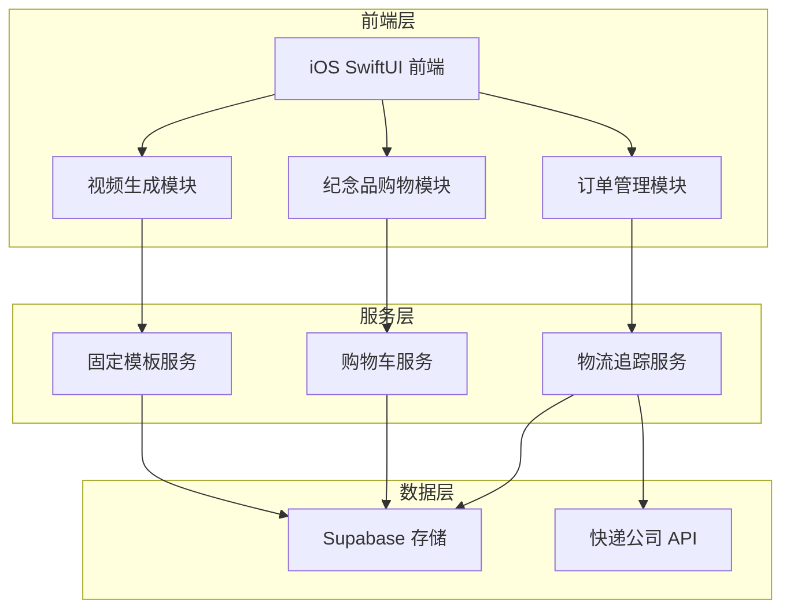
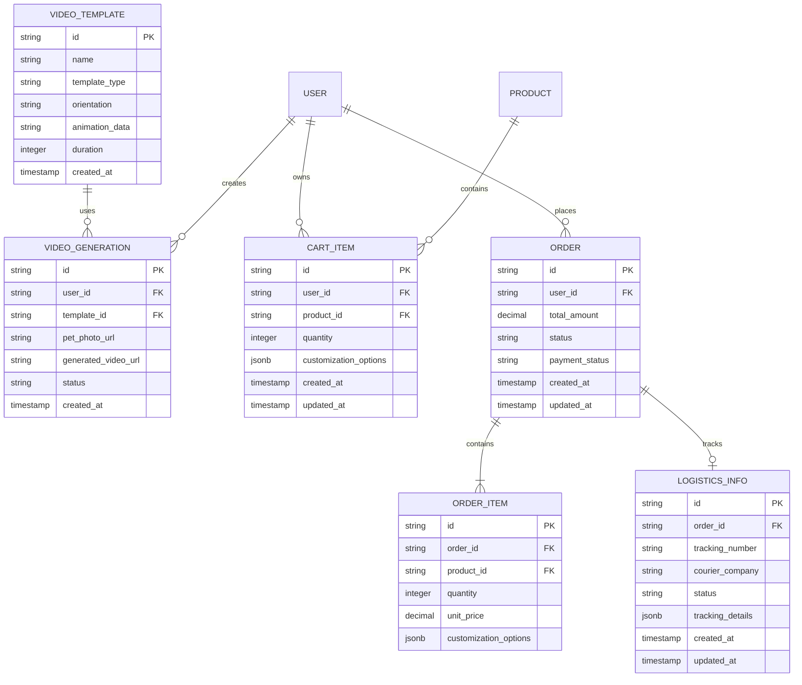

# Forever Paws 前端功能优化技术架构文档

## 1. 架构设计



## 2. 技术描述

- 前端：SwiftUI + SwiftData + iOS 17+
- 后端：Supabase (PostgreSQL + 实时订阅)
- 存储：Supabase Storage (视频模板和用户内容)
- 外部服务：快递鸟API / 快递100API (物流查询)

## 3. 路由定义

| 路由 | 用途 |
|------|-----|
| /video-generation | 视频生成页面，包含模板选择和动作选择 |
| /memorial-products | 纪念品商城主页，商品浏览和分类 |
| /cart | 购物车页面，商品管理和结算 |
| /orders | 订单管理页面，查看订单状态 |
| /order-tracking/:id | 物流追踪页面，显示具体订单的物流信息 |
| /admin/products | 管理员商品管理页面 |
| /admin/orders | 管理员订单处理页面 |

## 4. API 定义

### 4.1 视频生成相关 API

**生成固定模板视频**
```
POST /api/video/generate-template
```

请求参数：
| 参数名 | 参数类型 | 是否必需 | 描述 |
|--------|----------|----------|------|
| pet_photo_url | string | true | 宠物照片URL |
| template_type | string | true | 模板类型：standing/sitting |
| orientation | string | true | 视频方向：landscape/portrait |
| user_id | string | true | 用户ID |

响应：
| 参数名 | 参数类型 | 描述 |
|--------|----------|------|
| video_url | string | 生成的视频URL |
| task_id | string | 任务ID，用于查询进度 |
| status | string | 生成状态 |

### 4.2 购物车相关 API

**添加商品到购物车**
```
POST /api/cart/add
```

请求参数：
| 参数名 | 参数类型 | 是否必需 | 描述 |
|--------|----------|----------|------|
| product_id | string | true | 商品ID |
| quantity | integer | true | 数量 |
| customization | object | false | 定制选项 |

**获取购物车内容**
```
GET /api/cart
```

**快速结算**
```
POST /api/cart/checkout
```

### 4.3 物流追踪相关 API

**查询物流信息**
```
GET /api/logistics/track/:tracking_number
```

响应：
| 参数名 | 参数类型 | 描述 |
|--------|----------|------|
| tracking_number | string | 快递单号 |
| courier_company | string | 快递公司 |
| status | string | 物流状态 |
| tracking_info | array | 物流轨迹信息 |

**管理员上传物流信息**
```
POST /api/admin/logistics/upload
```

## 5. 数据模型

### 5.1 数据模型定义



### 5.2 数据定义语言

**视频模板表 (video_templates)**
```sql
-- 创建视频模板表
CREATE TABLE video_templates (
    id UUID PRIMARY KEY DEFAULT gen_random_uuid(),
    name VARCHAR(100) NOT NULL,
    template_type VARCHAR(20) NOT NULL CHECK (template_type IN ('standing', 'sitting')),
    orientation VARCHAR(20) NOT NULL CHECK (orientation IN ('landscape', 'portrait')),
    animation_data JSONB NOT NULL,
    duration INTEGER DEFAULT 10,
    preview_url TEXT,
    created_at TIMESTAMP WITH TIME ZONE DEFAULT NOW()
);

-- 创建索引
CREATE INDEX idx_video_templates_type ON video_templates(template_type);
CREATE INDEX idx_video_templates_orientation ON video_templates(orientation);

-- 初始化数据
INSERT INTO video_templates (name, template_type, orientation, animation_data) VALUES
('站立摇尾横屏', 'standing', 'landscape', '{"actions": ["tail_wag", "head_shake"], "duration": 10}'),
('站立摇尾竖屏', 'standing', 'portrait', '{"actions": ["tail_wag", "head_shake"], "duration": 10}'),
('坐立舔爪横屏', 'sitting', 'landscape', '{"actions": ["tail_wag", "paw_lick"], "duration": 10}'),
('坐立舔爪竖屏', 'sitting', 'portrait', '{"actions": ["tail_wag", "paw_lick"], "duration": 10}');
```

**购物车表 (cart_items)**
```sql
-- 创建购物车表
CREATE TABLE cart_items (
    id UUID PRIMARY KEY DEFAULT gen_random_uuid(),
    user_id UUID NOT NULL,
    product_id UUID NOT NULL REFERENCES products(id) ON DELETE CASCADE,
    quantity INTEGER NOT NULL DEFAULT 1 CHECK (quantity > 0),
    customization_options JSONB,
    created_at TIMESTAMP WITH TIME ZONE DEFAULT NOW(),
    updated_at TIMESTAMP WITH TIME ZONE DEFAULT NOW(),
    UNIQUE(user_id, product_id)
);

-- 创建索引
CREATE INDEX idx_cart_items_user_id ON cart_items(user_id);
CREATE INDEX idx_cart_items_product_id ON cart_items(product_id);

-- 设置权限
GRANT SELECT, INSERT, UPDATE, DELETE ON cart_items TO authenticated;
GRANT SELECT ON cart_items TO anon;
```

**物流信息表 (logistics_info)**
```sql
-- 创建物流信息表
CREATE TABLE logistics_info (
    id UUID PRIMARY KEY DEFAULT gen_random_uuid(),
    order_id UUID NOT NULL REFERENCES orders(id) ON DELETE CASCADE,
    tracking_number VARCHAR(50) NOT NULL,
    courier_company VARCHAR(50) NOT NULL,
    status VARCHAR(20) DEFAULT 'pending' CHECK (status IN ('pending', 'picked_up', 'in_transit', 'delivered', 'exception')),
    tracking_details JSONB DEFAULT '[]',
    created_at TIMESTAMP WITH TIME ZONE DEFAULT NOW(),
    updated_at TIMESTAMP WITH TIME ZONE DEFAULT NOW()
);

-- 创建索引
CREATE INDEX idx_logistics_info_order_id ON logistics_info(order_id);
CREATE INDEX idx_logistics_info_tracking_number ON logistics_info(tracking_number);
CREATE INDEX idx_logistics_info_status ON logistics_info(status);

-- 设置权限
GRANT SELECT ON logistics_info TO authenticated;
GRANT ALL PRIVILEGES ON logistics_info TO service_role;
```

**更新产品分类枚举**
```sql
-- 更新产品分类，添加更多分类
ALTER TYPE product_category ADD VALUE IF NOT EXISTS 'urns';
ALTER TYPE product_category ADD VALUE IF NOT EXISTS 'keychains';
ALTER TYPE product_category ADD VALUE IF NOT EXISTS 'ornaments';
```