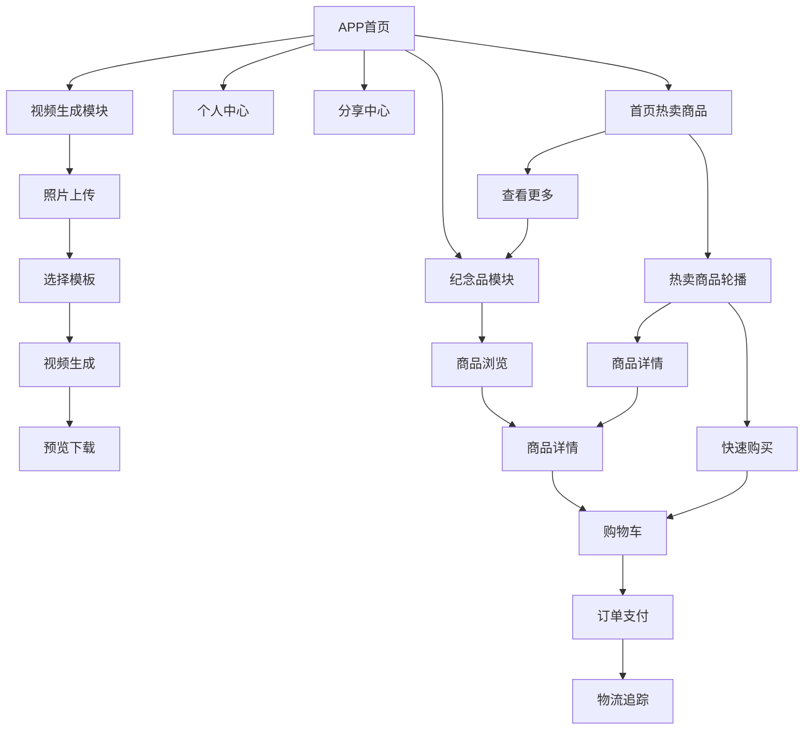

# Forever Paws 前端功能优化需求文档

## 1. 产品概述
Forever Paws 前端功能优化项目旨在改进现有的视频生成模块和纪念品购物模块，提升用户体验和功能完整性。
- 将视频生成从照片驱动改为固定模板驱动，提供标准化的宠物动画视频
- 优化纪念品购物流程，完善电商功能链路，提供完整的购物和物流追踪体验

## 2. 核心功能

### 2.1 用户角色
| 角色 | 注册方式 | 核心权限 |
|------|----------|----------|
| 普通用户 | 邮箱注册/社交登录 | 可生成视频、浏览购买纪念品、查看订单物流 |
| 管理员 | 后台邀请 | 可管理商品、处理订单、上传物流信息 |

### 2.2 功能模块
本次优化涉及以下主要页面：
1. **视频生成页面**：固定模板视频生成、横竖屏切换、宠物动作模板选择
2. **纪念品商城页面**：商品浏览、分类筛选、购物车管理、快速结算
3. **订单管理页面**：订单详情、支付状态、物流轨迹查询
4. **后台管理页面**：商品管理、订单处理、物流信息上传
5. **APP首页商品展示**：热卖商品展示区域、快速下单功能、商品推荐

### 2.3 页面详情

| 页面名称 | 模块名称 | 功能描述 |
|----------|----------|----------|
| 视频生成页面 | 模板选择器 | 提供横竖屏模板选择，10秒固定时长 |
| 视频生成页面 | 动作模板 | 站立姿态（摇尾巴摇头）、坐立姿态（摇尾巴舔爪子）选择 |
| 视频生成页面 | 宠物定制 | 上传宠物照片，应用到固定动作模板 |
| 纪念品商城页面 | 商品展示 | 移除重复搜索框，保留顶部搜索功能 |
| 纪念品商城页面 | 分类筛选 | 完善商品分类体系，支持多级分类 |
| 纪念品商城页面 | 购物车功能 | 修复添加商品问题，支持数量调整和删除 |
| 纪念品商城页面 | 快速结算 | 一键结算功能，支持多种支付方式 |
| 订单管理页面 | 物流追踪 | 集成主流快递公司API，实时查询物流状态 |
| APP首页商品展示 | 热卖商品展示 | 在首页底部展示3-5个热卖商品，支持轮播切换 |
| APP首页商品展示 | 商品快速购买 | 商品卡片包含快速购买按钮，一键添加到购物车，支持数量选择 |
| APP首页商品展示 | 商品详情跳转 | 点击商品卡片跳转到详细的商品页面，查看完整信息 |
| APP首页商品展示 | 查看更多功能 | 提供"查看更多"按钮，跳转到完整纪念品模块，浏览所有商品 |
| APP首页商品展示 | 响应式布局 | 适配不同屏幕尺寸，横屏显示更多商品 |
| 后台管理页面 | 物流管理 | 管理员上传快递单号，更新订单状态 |

## 3. 核心流程

### 3.1 视频生成流程
用户进入视频生成页面 → 选择视频方向（横屏/竖屏）→ 选择宠物动作模板（站立/坐立）→ 上传宠物照片 → 系统应用固定模板生成10秒视频 → 用户预览和下载

### 3.2 纪念品购物流程
用户浏览商品 → 使用分类筛选或搜索 → 查看商品详情 → 添加到购物车 → 购物车管理 → 快速结算 → 支付完成 → 订单生成 → 物流追踪

### 3.3 首页商品展示流程
用户打开APP进入首页 → 滚动到页面底部查看热卖商品 → 浏览商品轮播展示 → 点击商品卡片查看详情或快速购买 → 使用快速购买功能直接添加到购物车 → 点击"查看更多"进入完整商品页面

## 4. 用户界面设计

### 4.1 设计风格
- 主色调：粉色渐变 (#E879F9 到 #F472B6)，紫色辅助色
- 按钮样式：圆角渐变按钮，支持触觉反馈
- 字体：系统字体，标题使用 semibold，正文使用 regular
- 布局风格：卡片式设计，顶部导航，底部标签栏
- 图标风格：SF Symbols 系统图标，保持一致性

### 4.2 页面设计概览

| 页面名称 | 模块名称 | UI元素 |
|----------|----------|---------|
| 视频生成页面 | 模板选择器 | 横竖屏切换按钮，渐变背景，卡片式布局 |
| 视频生成页面 | 动作选择 | 动画预览卡片，选中状态高亮，描述文字 |
| 纪念品商城页面 | 搜索栏 | 移除重复搜索框，保留顶部 searchable 功能 |
| 纪念品商城页面 | 分类筛选 | 水平滚动分类标签，选中状态渐变背景 |
| 购物车页面 | 商品列表 | 商品卡片，数量调整器，删除按钮，价格计算 |
| 购物车页面 | 结算按钮 | 底部固定渐变按钮，显示总价和商品数量 |
| 物流追踪页面 | 时间轴 | 垂直时间轴设计，状态图标，时间和描述信息 |

### 4.3 响应式设计
- 主要针对 iOS 设备优化，支持 iPhone 和 iPad
- 适配不同屏幕尺寸，使用 SwiftUI 的自适应布局
- 支持深色模式和浅色模式切换
- 优化触摸交互，确保按钮和可点击区域足够大