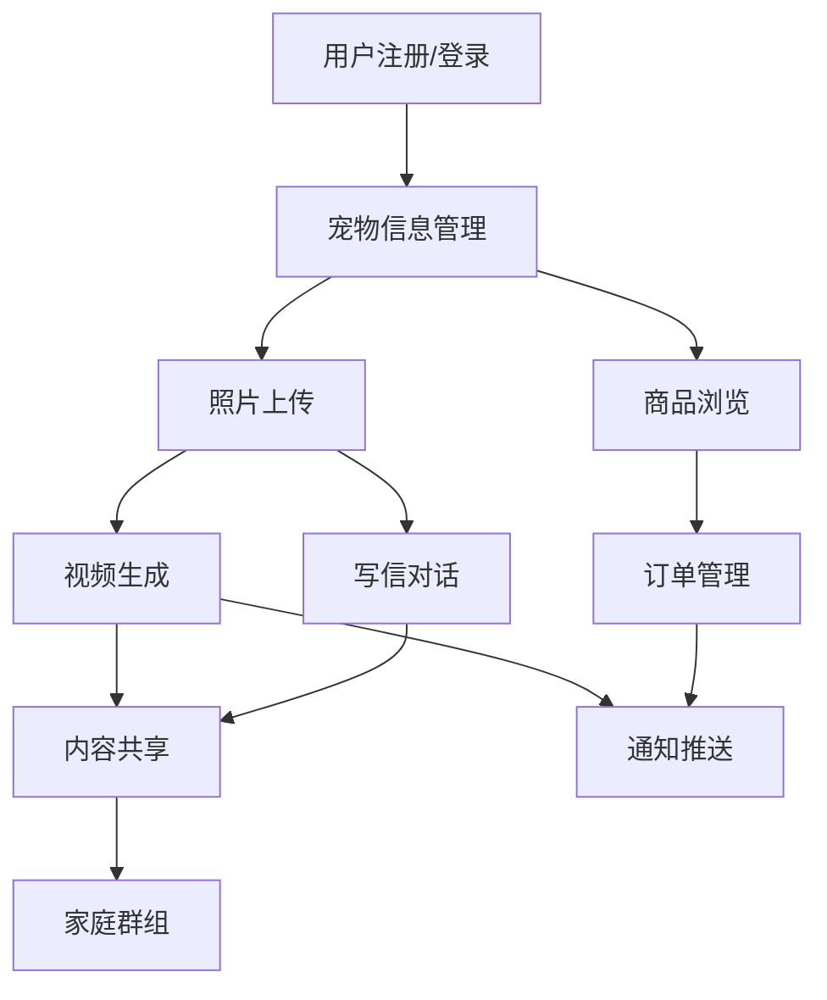

# 宠物纪念 APP 后端系统产品需求文档

## 1. Product Overview

宠物纪念 APP 后端系统是一个为宠物主人提供纪念服务的综合性平台，支持用户上传宠物照片生成纪念视频、与宠物进行虚拟对话、家庭成员共享纪念内容，以及购买纪念商品等功能。

- 主要解决宠物主人对逝去宠物的情感寄托需求，通过 AI 技术提供个性化的纪念服务体验。
- 目标用户为有宠物纪念需求的个人和家庭，帮助他们保存美好回忆并获得情感慰藉。
- 产品目标是成为宠物纪念服务领域的领先平台，提供从数字纪念到实体商品的全方位服务。

## 2. Core Features

### 2.1 User Roles

| Role | Registration Method | Core Permissions |
|------|---------------------|------------------|
| 普通用户 | 邮箱注册、Apple ID、Google 账号 | 基础功能使用、个人内容管理、单个家庭群组加入 |
| 家庭管理员 | 普通用户升级 | 创建家庭群组、邀请成员、管理家庭共享内容 |
| 系统管理员 | 后台分配 | 商品管理、订单处理、用户管理、系统配置 |

### 2.2 Feature Module

我们的宠物纪念 APP 后端系统包含以下主要页面模块：

1. **用户认证模块**：用户注册登录、第三方登录集成、用户资料管理
2. **宠物管理模块**：宠物信息注册、照片管理、纪念日期设置
3. **视频生成模块**：图片上传处理、AI 视频生成、任务状态管理
4. **写信对话模块**：用户与宠物对话、AI 回复生成、历史记录管理
5. **家庭共享模块**：家庭群组创建、成员邀请、内容共享权限
6. **商品商城模块**：纪念商品展示、订单处理、支付集成
7. **通知系统模块**：任务状态通知、订单更新、系统消息推送

### 2.3 Page Details

| Page Name | Module Name | Feature description |
|-----------|-------------|---------------------|
| 用户认证模块 | 邮箱注册登录 | 处理用户邮箱注册、登录验证、密码重置、邮箱确认流程 |
| 用户认证模块 | 第三方登录 | 集成 Apple Sign In 和 Google OAuth，处理第三方认证回调和用户信息同步 |
| 用户认证模块 | 用户资料管理 | 用户个人信息更新、头像上传、偏好设置、隐私配置 |
| 宠物管理模块 | 宠物信息注册 | 宠物基本信息录入、品种选择、性格特征设置、纪念日期记录 |
| 宠物管理模块 | 照片管理 | 宠物照片上传、存储、分类管理、权限控制 |
| 视频生成模块 | 图片处理 | 接收用户上传的宠物照片、格式验证、尺寸优化、云存储上传 |
| 视频生成模块 | AI 视频生成 | 调用 DashScope API 生成纪念视频、任务状态跟踪、进度更新 |
| 视频生成模块 | 任务管理 | 视频生成任务创建、状态查询、结果存储、失败重试机制 |
| 写信对话模块 | 对话管理 | 用户与宠物的对话记录、消息存储、会话管理 |
| 写信对话模块 | AI 回复生成 | 基于宠物性格和用户输入生成个性化 AI 回复 |
| 家庭共享模块 | 群组管理 | 家庭群组创建、邀请码生成、成员权限管理、群组设置 |
| 家庭共享模块 | 内容共享 | 宠物信息、视频、对话记录在家庭成员间的共享和权限控制 |
| 商品商城模块 | 商品管理 | 纪念商品信息管理、库存控制、价格设置、分类管理 |
| 商品商城模块 | 订单处理 | 订单创建、支付处理、状态更新、发货管理 |
| 通知系统模块 | 消息推送 | 视频生成完成通知、订单状态变更、系统消息推送 |

## 3. Core Process

### 普通用户流程
用户首先进行注册登录，然后添加宠物信息并上传照片。用户可以选择生成纪念视频或与宠物进行对话。生成的内容可以在家庭群组中共享，用户也可以浏览商城购买纪念商品。

### 家庭管理员流程
家庭管理员除了拥有普通用户的所有功能外，还可以创建家庭群组，邀请其他成员加入，管理群组内容的共享权限，以及处理群组设置。

### 系统管理员流程
系统管理员通过后台管理界面管理商品信息、处理订单、监控系统状态，以及处理用户反馈和技术支持请求。

## 4. User Interface Design

### 4.1 Design Style

- **主色调**：温暖的橙色 (#FF6B35) 和柔和的蓝色 (#4A90E2)
- **辅助色**：浅灰色 (#F5F5F5) 和深灰色 (#333333)
- **按钮样式**：圆角矩形，带有轻微阴影效果
- **字体**：系统默认字体，标题使用 18-24px，正文使用 14-16px
- **布局风格**：卡片式设计，顶部导航栏，底部标签栏
- **图标风格**：线性图标，简洁现代，与宠物主题相关的温馨图标

### 4.2 Page Design Overview

| Page Name | Module Name | UI Elements |
|-----------|-------------|-------------|
| 用户认证页面 | 登录注册表单 | 简洁的输入框、渐变背景、品牌 Logo、第三方登录按钮 |
| 宠物管理页面 | 宠物信息卡片 | 圆形头像、信息卡片布局、添加按钮、编辑图标 |
| 视频生成页面 | 上传和预览区域 | 拖拽上传区域、进度条、预览窗口、生成按钮 |
| 对话页面 | 聊天界面 | 消息气泡、输入框、发送按钮、历史记录列表 |
| 家庭共享页面 | 成员列表和权限 | 成员头像列表、权限开关、邀请按钮、群组设置 |
| 商城页面 | 商品网格布局 | 商品卡片、价格标签、购买按钮、分类筛选 |

### 4.3 Responsiveness

产品采用移动端优先设计，支持 iOS 和 Android 平台的原生应用。界面针对触摸交互进行优化，支持手势操作，确保在不同屏幕尺寸下的良好用户体验。后端 API 设计支持多平台调用，为未来的 Web 端扩展预留接口。