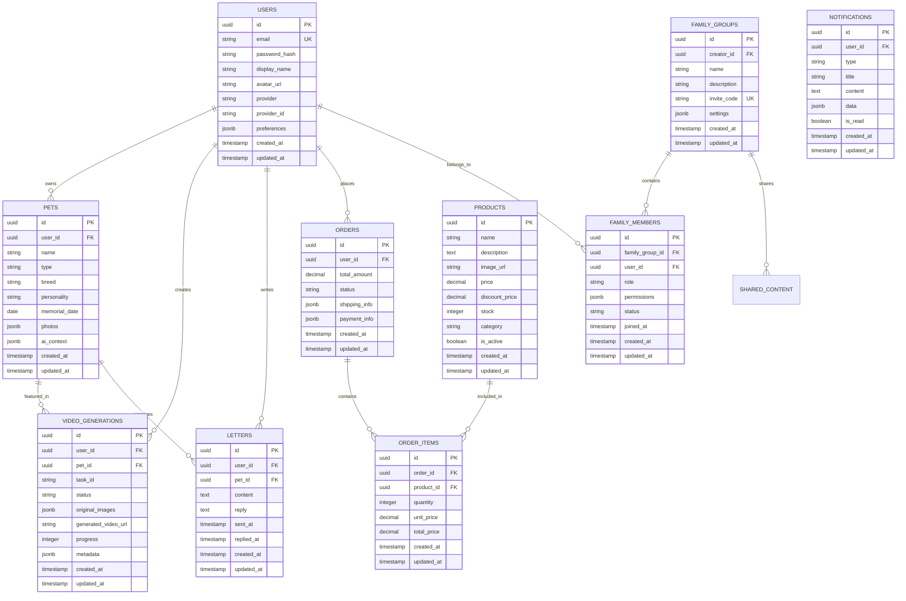

# 宠物纪念 APP 后端系统技术架构文档

## 1. Architecture design


## 2. Technology Description

- Frontend: iOS Swift + SwiftUI + Supabase Client SDK
- Backend: Node.js + Express.js + TypeScript
- Database: Supabase (PostgreSQL)
- Storage: Supabase Storage
- Authentication: Supabase Auth + Apple Sign In + Google OAuth
- AI Services: DashScope API (阿里云)
- Push Notifications: Apple Push Notification Service (APNs)
- Payment: Apple In-App Purchase

## 3. Route definitions

| Route | Purpose |
|-------|---------|
| /api/auth/register | 用户邮箱注册接口 |
| /api/auth/login | 用户邮箱登录接口 |
| /api/auth/oauth/apple | Apple Sign In 回调处理 |
| /api/auth/oauth/google | Google OAuth 回调处理 |
| /api/auth/refresh | 刷新访问令牌 |
| /api/users/profile | 用户资料管理 |
| /api/pets | 宠物信息管理 |
| /api/pets/:id/photos | 宠物照片管理 |
| /api/videos/generate | 视频生成任务创建 |
| /api/videos/status/:taskId | 视频生成状态查询 |
| /api/videos/history | 用户视频生成历史 |
| /api/letters | 写信对话管理 |
| /api/letters/:id/reply | AI 回复生成 |
| /api/families | 家庭群组管理 |
| /api/families/:id/members | 家庭成员管理 |
| /api/families/join | 通过邀请码加入家庭 |
| /api/products | 商品信息查询 |
| /api/orders | 订单管理 |
| /api/orders/:id/payment | 订单支付处理 |
| /api/notifications | 通知消息管理 |

## 4. API definitions

### 4.1 Core API

#### 用户认证相关

**用户注册**
```
POST /api/auth/register
```

Request:
| Param Name | Param Type | isRequired | Description |
|------------|------------|------------|-------------|
| email | string | true | 用户邮箱地址 |
| password | string | true | 用户密码（明文） |
| displayName | string | false | 用户显示名称 |

Response:
| Param Name | Param Type | Description |
|------------|------------|-------------|
| code | number | 响应状态码 |
| message | string | 响应消息 |
| data | object | 用户信息和令牌 |

Example:
```json
{
  "email": "user@example.com",
  "password": "password123",
  "displayName": "Pet Lover"
}
```

**用户登录**
```
POST /api/auth/login
```

Request:
| Param Name | Param Type | isRequired | Description |
|------------|------------|------------|-------------|
| email | string | true | 用户邮箱地址 |
| password | string | true | 用户密码 |

Response:
| Param Name | Param Type | Description |
|------------|------------|-------------|
| code | number | 响应状态码 |
| message | string | 响应消息 |
| data | object | 包含 access_token, refresh_token, user 信息 |

#### 宠物管理相关

**创建宠物信息**
```
POST /api/pets
```

Request:
| Param Name | Param Type | isRequired | Description |
|------------|------------|------------|-------------|
| name | string | true | 宠物名称 |
| type | string | true | 宠物类型（dog, cat, etc.） |
| breed | string | false | 宠物品种 |
| personality | string | false | 宠物性格描述 |
| memorialDate | string | false | 纪念日期 |
| photos | array | false | 宠物照片 URL 数组 |

#### 视频生成相关

**创建视频生成任务**
```
POST /api/videos/generate
```

Request:
| Param Name | Param Type | isRequired | Description |
|------------|------------|------------|-------------|
| petId | string | true | 宠物 ID |
| imageUrls | array | true | 图片 URL 数组（最多2张） |
| prompt | string | false | 生成提示词 |

Response:
| Param Name | Param Type | Description |
|------------|------------|-------------|
| code | number | 响应状态码 |
| message | string | 响应消息 |
| data | object | 包含 taskId, status 等信息 |

#### 写信对话相关

**创建对话记录**
```
POST /api/letters
```

Request:
| Param Name | Param Type | isRequired | Description |
|------------|------------|------------|-------------|
| petId | string | true | 宠物 ID |
| content | string | true | 用户写给宠物的内容 |

Response:
| Param Name | Param Type | Description |
|------------|------------|-------------|
| code | number | 响应状态码 |
| message | string | 响应消息 |
| data | object | 包含对话记录和 AI 回复 |

## 5. Server architecture diagram


## 6. Data model

### 6.1 Data model definition



### 6.2 Data Definition Language

**用户表 (users)**
```sql
-- 创建用户表
CREATE TABLE users (
    id UUID PRIMARY KEY DEFAULT gen_random_uuid(),
    email VARCHAR(255) UNIQUE NOT NULL,
    password_hash VARCHAR(255),
    display_name VARCHAR(100),
    avatar_url TEXT,
    provider VARCHAR(50) DEFAULT 'email',
    provider_id VARCHAR(255),
    preferences JSONB DEFAULT '{}',
    created_at TIMESTAMP WITH TIME ZONE DEFAULT NOW(),
    updated_at TIMESTAMP WITH TIME ZONE DEFAULT NOW()
);

-- 创建索引
CREATE INDEX idx_users_email ON users(email);
CREATE INDEX idx_users_provider ON users(provider, provider_id);

-- 设置权限
GRANT SELECT ON users TO anon;
GRANT ALL PRIVILEGES ON users TO authenticated;
```

**宠物表 (pets)**
```sql
-- 创建宠物表
CREATE TABLE pets (
    id UUID PRIMARY KEY DEFAULT gen_random_uuid(),
    user_id UUID NOT NULL REFERENCES users(id) ON DELETE CASCADE,
    name VARCHAR(100) NOT NULL,
    type VARCHAR(50) NOT NULL,
    breed VARCHAR(100),
    personality TEXT,
    memorial_date DATE,
    photos JSONB DEFAULT '[]',
    ai_context JSONB DEFAULT '{}',
    created_at TIMESTAMP WITH TIME ZONE DEFAULT NOW(),
    updated_at TIMESTAMP WITH TIME ZONE DEFAULT NOW()
);

-- 创建索引
CREATE INDEX idx_pets_user_id ON pets(user_id);
CREATE INDEX idx_pets_type ON pets(type);

-- 设置权限
GRANT SELECT ON pets TO anon;
GRANT ALL PRIVILEGES ON pets TO authenticated;
```

**视频生成记录表 (video_generations)**
```sql
-- 创建视频生成记录表
CREATE TABLE video_generations (
    id UUID PRIMARY KEY DEFAULT gen_random_uuid(),
    user_id UUID NOT NULL REFERENCES users(id) ON DELETE CASCADE,
    pet_id UUID NOT NULL REFERENCES pets(id) ON DELETE CASCADE,
    task_id VARCHAR(255) UNIQUE,
    status VARCHAR(50) DEFAULT 'pending',
    original_images JSONB DEFAULT '[]',
    generated_video_url TEXT,
    progress INTEGER DEFAULT 0,
    metadata JSONB DEFAULT '{}',
    created_at TIMESTAMP WITH TIME ZONE DEFAULT NOW(),
    updated_at TIMESTAMP WITH TIME ZONE DEFAULT NOW()
);

-- 创建索引
CREATE INDEX idx_video_generations_user_id ON video_generations(user_id);
CREATE INDEX idx_video_generations_pet_id ON video_generations(pet_id);
CREATE INDEX idx_video_generations_task_id ON video_generations(task_id);
CREATE INDEX idx_video_generations_status ON video_generations(status);

-- 设置权限
GRANT SELECT ON video_generations TO anon;
GRANT ALL PRIVILEGES ON video_generations TO authenticated;
```

**写信记录表 (letters)**
```sql
-- 创建写信记录表
CREATE TABLE letters (
    id UUID PRIMARY KEY DEFAULT gen_random_uuid(),
    user_id UUID NOT NULL REFERENCES users(id) ON DELETE CASCADE,
    pet_id UUID NOT NULL REFERENCES pets(id) ON DELETE CASCADE,
    content TEXT NOT NULL,
    reply TEXT,
    sent_at TIMESTAMP WITH TIME ZONE DEFAULT NOW(),
    replied_at TIMESTAMP WITH TIME ZONE,
    created_at TIMESTAMP WITH TIME ZONE DEFAULT NOW(),
    updated_at TIMESTAMP WITH TIME ZONE DEFAULT NOW()
);

-- 创建索引
CREATE INDEX idx_letters_user_id ON letters(user_id);
CREATE INDEX idx_letters_pet_id ON letters(pet_id);
CREATE INDEX idx_letters_sent_at ON letters(sent_at DESC);

-- 设置权限
GRANT SELECT ON letters TO anon;
GRANT ALL PRIVILEGES ON letters TO authenticated;
```

**家庭群组表 (family_groups)**
```sql
-- 创建家庭群组表
CREATE TABLE family_groups (
    id UUID PRIMARY KEY DEFAULT gen_random_uuid(),
    creator_id UUID NOT NULL REFERENCES users(id) ON DELETE CASCADE,
    name VARCHAR(100) NOT NULL,
    description TEXT,
    invite_code VARCHAR(20) UNIQUE NOT NULL,
    settings JSONB DEFAULT '{}',
    created_at TIMESTAMP WITH TIME ZONE DEFAULT NOW(),
    updated_at TIMESTAMP WITH TIME ZONE DEFAULT NOW()
);

-- 创建索引
CREATE INDEX idx_family_groups_creator_id ON family_groups(creator_id);
CREATE INDEX idx_family_groups_invite_code ON family_groups(invite_code);

-- 设置权限
GRANT SELECT ON family_groups TO anon;
GRANT ALL PRIVILEGES ON family_groups TO authenticated;
```

**家庭成员表 (family_members)**
```sql
-- 创建家庭成员表
CREATE TABLE family_members (
    id UUID PRIMARY KEY DEFAULT gen_random_uuid(),
    family_group_id UUID NOT NULL REFERENCES family_groups(id) ON DELETE CASCADE,
    user_id UUID NOT NULL REFERENCES users(id) ON DELETE CASCADE,
    role VARCHAR(50) DEFAULT 'member',
    permissions JSONB DEFAULT '[]',
    status VARCHAR(50) DEFAULT 'active',
    joined_at TIMESTAMP WITH TIME ZONE DEFAULT NOW(),
    created_at TIMESTAMP WITH TIME ZONE DEFAULT NOW(),
    updated_at TIMESTAMP WITH TIME ZONE DEFAULT NOW(),
    UNIQUE(family_group_id, user_id)
);

-- 创建索引
CREATE INDEX idx_family_members_family_group_id ON family_members(family_group_id);
CREATE INDEX idx_family_members_user_id ON family_members(user_id);

-- 设置权限
GRANT SELECT ON family_members TO anon;
GRANT ALL PRIVILEGES ON family_members TO authenticated;
```

**商品表 (products)**
```sql
-- 创建商品表
CREATE TABLE products (
    id UUID PRIMARY KEY DEFAULT gen_random_uuid(),
    name VARCHAR(200) NOT NULL,
    description TEXT,
    image_url TEXT,
    price DECIMAL(10,2) NOT NULL,
    discount_price DECIMAL(10,2),
    stock INTEGER DEFAULT 0,
    category VARCHAR(100),
    is_active BOOLEAN DEFAULT true,
    created_at TIMESTAMP WITH TIME ZONE DEFAULT NOW(),
    updated_at TIMESTAMP WITH TIME ZONE DEFAULT NOW()
);

-- 创建索引
CREATE INDEX idx_products_category ON products(category);
CREATE INDEX idx_products_is_active ON products(is_active);

-- 设置权限
GRANT SELECT ON products TO anon;
GRANT ALL PRIVILEGES ON products TO authenticated;
```

**订单表 (orders)**
```sql
-- 创建订单表
CREATE TABLE orders (
    id UUID PRIMARY KEY DEFAULT gen_random_uuid(),
    user_id UUID NOT NULL REFERENCES users(id) ON DELETE CASCADE,
    total_amount DECIMAL(10,2) NOT NULL,
    status VARCHAR(50) DEFAULT 'pending',
    shipping_info JSONB DEFAULT '{}',
    payment_info JSONB DEFAULT '{}',
    created_at TIMESTAMP WITH TIME ZONE DEFAULT NOW(),
    updated_at TIMESTAMP WITH TIME ZONE DEFAULT NOW()
);

-- 创建索引
CREATE INDEX idx_orders_user_id ON orders(user_id);
CREATE INDEX idx_orders_status ON orders(status);
CREATE INDEX idx_orders_created_at ON orders(created_at DESC);

-- 设置权限
GRANT SELECT ON orders TO anon;
GRANT ALL PRIVILEGES ON orders TO authenticated;
```

**订单项表 (order_items)**
```sql
-- 创建订单项表
CREATE TABLE order_items (
    id UUID PRIMARY KEY DEFAULT gen_random_uuid(),
    order_id UUID NOT NULL REFERENCES orders(id) ON DELETE CASCADE,
    product_id UUID NOT NULL REFERENCES products(id) ON DELETE CASCADE,
    quantity INTEGER NOT NULL DEFAULT 1,
    unit_price DECIMAL(10,2) NOT NULL,
    total_price DECIMAL(10,2) NOT NULL,
    created_at TIMESTAMP WITH TIME ZONE DEFAULT NOW(),
    updated_at TIMESTAMP WITH TIME ZONE DEFAULT NOW()
);

-- 创建索引
CREATE INDEX idx_order_items_order_id ON order_items(order_id);
CREATE INDEX idx_order_items_product_id ON order_items(product_id);

-- 设置权限
GRANT SELECT ON order_items TO anon;
GRANT ALL PRIVILEGES ON order_items TO authenticated;
```

**通知表 (notifications)**
```sql
-- 创建通知表
CREATE TABLE notifications (
    id UUID PRIMARY KEY DEFAULT gen_random_uuid(),
    user_id UUID NOT NULL REFERENCES users(id) ON DELETE CASCADE,
    type VARCHAR(50) NOT NULL,
    title VARCHAR(200) NOT NULL,
    content TEXT,
    data JSONB DEFAULT '{}',
    is_read BOOLEAN DEFAULT false,
    created_at TIMESTAMP WITH TIME ZONE DEFAULT NOW(),
    updated_at TIMESTAMP WITH TIME ZONE DEFAULT NOW()
);

-- 创建索引
CREATE INDEX idx_notifications_user_id ON notifications(user_id);
CREATE INDEX idx_notifications_type ON notifications(type);
CREATE INDEX idx_notifications_is_read ON notifications(is_read);
CREATE INDEX idx_notifications_created_at ON notifications(created_at DESC);

-- 设置权限
GRANT SELECT ON notifications TO anon;
GRANT ALL PRIVILEGES ON notifications TO authenticated;
```

**初始化数据**
```sql
-- 插入示例商品数据
INSERT INTO products (name, description, image_url, price, category, stock) VALUES
('宠物纪念项链', '定制宠物照片项链，永恒的纪念', 'https://example.com/necklace.jpg', 199.00, 'jewelry', 100),
('宠物纪念墓碑', '个性化宠物墓碑，刻上宠物信息', 'https://example.com/tombstone.jpg', 599.00, 'memorial', 50),
('宠物纪念相框', '精美相框，展示宠物最美瞬间', 'https://example.com/frame.jpg', 89.00, 'decoration', 200);
```