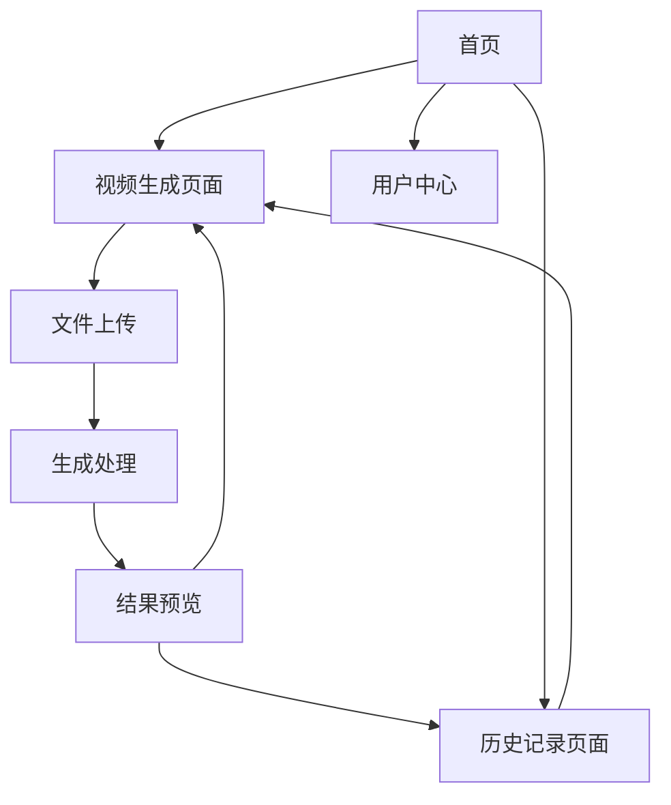

# 视频生成应用产品需求文档

## 1. 产品概述
基于阿里云万象2.5-i2v-preview模型的智能视频生成应用，用户可以上传视频文件并自动生成3秒的优化视频内容。
- 解决用户快速生成短视频内容的需求，适用于内容创作者、营销人员和个人用户
- 通过AI技术降低视频制作门槛，提升内容创作效率和质量

## 2. 核心功能

### 2.1 用户角色
| 角色 | 注册方式 | 核心权限 |
|------|----------|----------|
| 普通用户 | 邮箱注册 | 可上传视频、生成内容、查看历史记录 |

### 2.2 功能模块
我们的视频生成应用包含以下主要页面：
1. **首页**：产品介绍、快速上传入口、最新生成视频展示
2. **视频生成页面**：视频上传、参数设置、生成进度、结果预览
3. **历史记录页面**：历史生成记录、视频管理、下载功能
4. **用户中心**：个人信息、使用统计、设置管理

### 2.3 页面详情
| 页面名称 | 模块名称 | 功能描述 |
|----------|----------|----------|
| 首页 | 产品介绍区 | 展示产品特色、使用流程说明、示例视频 |
| 首页 | 快速上传区 | 提供拖拽上传入口、支持格式说明 |
| 首页 | 最新作品展示 | 展示最近生成的优质视频内容 |
| 视频生成页面 | 文件上传模块 | 支持拖拽上传、格式验证、文件预览 |
| 视频生成页面 | 生成控制模块 | 开始生成、进度显示、状态更新 |
| 视频生成页面 | 结果预览模块 | 生成视频播放、下载、分享功能 |
| 历史记录页面 | 记录列表 | 显示历史生成记录、缩略图、生成时间 |
| 历史记录页面 | 视频管理 | 播放、下载、删除、重新生成功能 |
| 用户中心 | 个人信息 | 用户资料编辑、头像上传 |
| 用户中心 | 使用统计 | 生成次数、存储使用量、API调用统计 |

## 3. 核心流程
用户首先在首页了解产品功能，然后进入视频生成页面上传视频文件。系统验证文件格式后，调用阿里云万象2.5模型进行处理，实时显示生成进度。生成完成后用户可以预览、下载视频，所有记录保存到历史页面供后续查看和管理。

## 4. 用户界面设计
### 4.1 设计风格
- 主色调：深蓝色(#1e40af)，辅助色：浅蓝色(#3b82f6)和白色(#ffffff)
- 按钮样式：圆角矩形，渐变背景，悬停效果
- 字体：系统默认字体，标题18-24px，正文14-16px
- 布局风格：卡片式设计，顶部导航栏，响应式网格布局
- 图标风格：线性图标，统一的视觉语言

### 4.2 页面设计概览
| 页面名称 | 模块名称 | UI元素 |
|----------|----------|--------|
| 首页 | 产品介绍区 | 大标题、特色图标、渐变背景、动画效果 |
| 首页 | 快速上传区 | 虚线边框拖拽区域、上传图标、提示文字 |
| 视频生成页面 | 文件上传模块 | 拖拽上传区、进度条、文件信息卡片 |
| 视频生成页面 | 生成控制模块 | 主要操作按钮、环形进度指示器、状态文字 |
| 视频生成页面 | 结果预览模块 | 视频播放器、操作按钮组、分享面板 |
| 历史记录页面 | 记录列表 | 网格布局、视频缩略图、时间标签、操作菜单 |
| 用户中心 | 个人信息 | 表单输入框、头像上传区、保存按钮 |

### 4.3 响应式设计
产品采用移动优先的响应式设计，在桌面端提供更丰富的交互体验，移动端优化触摸操作和单手使用体验。