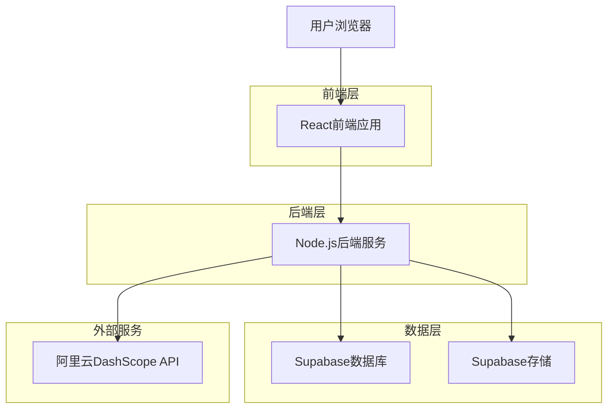
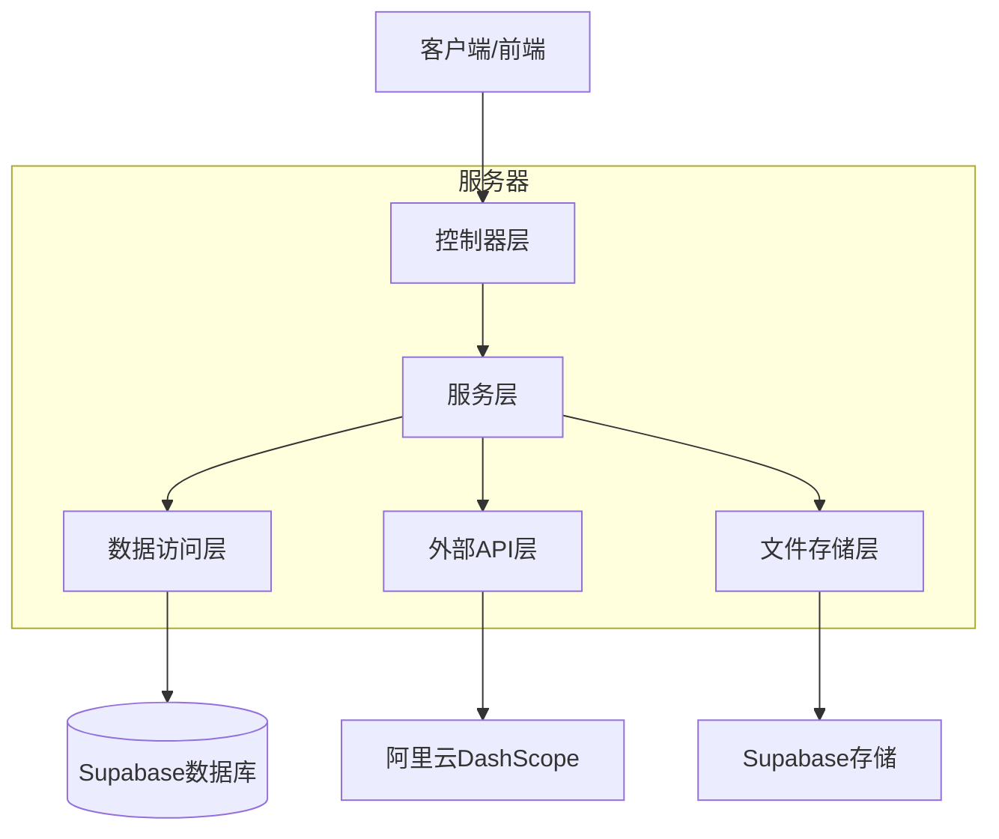
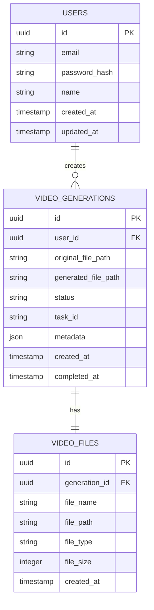

# 视频生成应用技术架构文档

## 1. 架构设计



## 2. 技术描述
- 前端：React@18 + TypeScript + Tailwind CSS + Vite
- 后端：Node.js + Express@4 + TypeScript
- 数据库：Supabase (PostgreSQL)
- 文件存储：Supabase Storage
- 外部API：阿里云DashScope万象2.5-i2v-preview

## 3. 路由定义
| 路由 | 用途 |
|------|------|
| / | 首页，展示产品介绍和快速上传入口 |
| /generate | 视频生成页面，处理文件上传和生成流程 |
| /history | 历史记录页面，显示用户的生成历史 |
| /profile | 用户中心，个人信息和设置管理 |
| /login | 登录页面，用户身份验证 |
| /register | 注册页面，新用户注册 |

## 4. API定义

### 4.1 核心API

用户认证相关
```
POST /api/auth/login
```

请求参数:
| 参数名 | 参数类型 | 是否必需 | 描述 |
|--------|----------|----------|------|
| email | string | true | 用户邮箱 |
| password | string | true | 用户密码 |

响应参数:
| 参数名 | 参数类型 | 描述 |
|--------|----------|------|
| success | boolean | 登录状态 |
| token | string | JWT认证令牌 |
| user | object | 用户信息 |

视频生成相关
```
POST /api/video/generate
```

请求参数:
| 参数名 | 参数类型 | 是否必需 | 描述 |
|--------|----------|----------|------|
| videoFile | File | true | 上传的视频文件 |
| userId | string | true | 用户ID |

响应参数:
| 参数名 | 参数类型 | 描述 |
|--------|----------|------|
| taskId | string | 生成任务ID |
| status | string | 任务状态 |

```
GET /api/video/status/:taskId
```

响应参数:
| 参数名 | 参数类型 | 描述 |
|--------|----------|------|
| status | string | 任务状态(pending/processing/completed/failed) |
| progress | number | 生成进度(0-100) |
| resultUrl | string | 生成视频URL(完成时) |

历史记录相关
```
GET /api/video/history
```

响应参数:
| 参数名 | 参数类型 | 描述 |
|--------|----------|------|
| videos | array | 历史视频列表 |
| total | number | 总数量 |

## 5. 服务器架构图



## 6. 数据模型

### 6.1 数据模型定义



### 6.2 数据定义语言

用户表 (users)
```sql
-- 创建用户表
CREATE TABLE users (
    id UUID PRIMARY KEY DEFAULT gen_random_uuid(),
    email VARCHAR(255) UNIQUE NOT NULL,
    password_hash VARCHAR(255) NOT NULL,
    name VARCHAR(100) NOT NULL,
    created_at TIMESTAMP WITH TIME ZONE DEFAULT NOW(),
    updated_at TIMESTAMP WITH TIME ZONE DEFAULT NOW()
);

-- 创建索引
CREATE INDEX idx_users_email ON users(email);
```

视频生成记录表 (video_generations)
```sql
-- 创建视频生成记录表
CREATE TABLE video_generations (
    id UUID PRIMARY KEY DEFAULT gen_random_uuid(),
    user_id UUID NOT NULL,
    original_file_path VARCHAR(500) NOT NULL,
    generated_file_path VARCHAR(500),
    status VARCHAR(20) DEFAULT 'pending' CHECK (status IN ('pending', 'processing', 'completed', 'failed')),
    task_id VARCHAR(100),
    metadata JSONB,
    created_at TIMESTAMP WITH TIME ZONE DEFAULT NOW(),
    completed_at TIMESTAMP WITH TIME ZONE
);

-- 创建索引
CREATE INDEX idx_video_generations_user_id ON video_generations(user_id);
CREATE INDEX idx_video_generations_status ON video_generations(status);
CREATE INDEX idx_video_generations_created_at ON video_generations(created_at DESC);

-- 设置权限
GRANT SELECT ON video_generations TO anon;
GRANT ALL PRIVILEGES ON video_generations TO authenticated;
```

视频文件表 (video_files)
```sql
-- 创建视频文件表
CREATE TABLE video_files (
    id UUID PRIMARY KEY DEFAULT gen_random_uuid(),
    generation_id UUID NOT NULL,
    file_name VARCHAR(255) NOT NULL,
    file_path VARCHAR(500) NOT NULL,
    file_type VARCHAR(50) NOT NULL,
    file_size INTEGER NOT NULL,
    created_at TIMESTAMP WITH TIME ZONE DEFAULT NOW()
);

-- 创建索引
CREATE INDEX idx_video_files_generation_id ON video_files(generation_id);

-- 设置权限
GRANT SELECT ON video_files TO anon;
GRANT ALL PRIVILEGES ON video_files TO authenticated;
```

环境变量配置
```bash
# 阿里云DashScope配置
DASHSCOPE_API_KEY=sk-381082d57c9a49b6becf6843505664d8
DASHSCOPE_USER_ID=1817635094148618
VIDEO_GENERATION_PROVIDER=dashscope
VIDEO_GENERATION_MODEL=wan2.5-i2v-preview

# Supabase配置
SUPABASE_URL=your_supabase_url
SUPABASE_ANON_KEY=your_supabase_anon_key
SUPABASE_SERVICE_ROLE_KEY=your_supabase_service_role_key

# 应用配置
JWT_SECRET=your_jwt_secret
PORT=3001
```